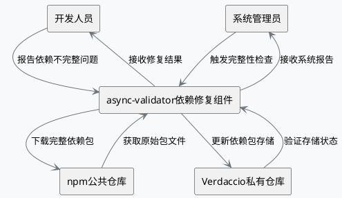
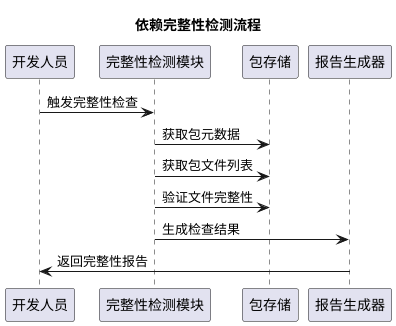
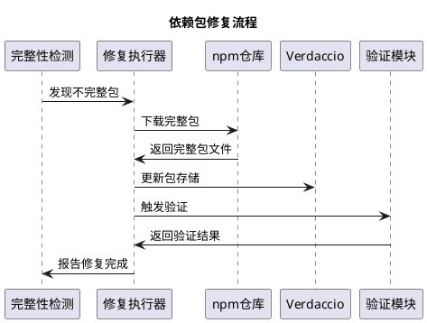
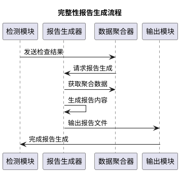

# **1. 组件定位**

## **1.1 核心职责**

本组件负责修复async-validator依赖在npm-install私有仓库管理系统中的不完整问题，实现依赖包的完整性和可用性保障。

## **1.2 核心输入**

1. 用户反馈：用户报告的async-validator依赖不完整问题
2. 系统检测：npm-install系统对依赖包完整性的自动检测结果
3. 构建请求：当项目需要使用async-validator时的构建或安装请求
4. 同步信号：从npm公共仓库同步依赖包的触发信号

## **1.3 核心输出**

1. 完整性报告：生成async-validator依赖包的完整性状态报告
2. 修复结果：返回依赖包修复的执行结果和状态
3. 验证通知：发送依赖包修复完成后的验证通过通知
4. 错误提醒：在修复失败时提供详细的错误信息和解决方案建议

## **1.4 职责边界**

1. 不负责async-validator依赖包的功能开发和bug修复
2. 不负责第三方依赖包的内容更新或版本升级决策
3. 不负责npm公共仓库的可用性保障
4. 不负责用户自定义构建流程的管理

# **2. 领域术语**

**async-validator**
: 一个用于异步表单验证的JavaScript库，支持基于规则的验证机制。

**离线包**
: 存储在项目本地`offline-packages`目录中的依赖包，用于离线环境使用。

**npm-install系统**
: 基于Verdaccio的私有npm仓库管理系统，支持自动依赖解析和离线包管理。

**依赖完整性**
: 依赖包包含所有必要文件（源代码、配置文件、文档、许可证等）的状态。

**构建产物**
: 依赖包经过编译或打包后生成的文件，通常位于dist或build目录中。

# **3. 角色与边界**

## **3.1 核心角色**

开发人员：使用npm-install系统管理项目依赖，需要完整的依赖包进行开发和调试。
系统管理员：负责维护npm-install系统的正常运行和依赖包管理。

## **3.2 外部系统**

npm公共仓库：提供async-validator依赖包的原始下载源。
Verdaccio私有仓库：管理项目本地依赖包的存储和分发。

## **3.3 交互上下文**

# **4. DFX约束**

## **4.1 性能**

1. 依赖完整性检查必须在30秒内完成
2. 依赖包修复操作必须在5分钟内完成
3. 系统在修复过程中必须保持对其他操作的响应

## **4.2 可靠性**

1. 系统必须保证99.9%的依赖修复成功率
2. 修复操作失败时必须自动回滚到原始状态
3. 必须记录所有修复操作的日志供审计使用

## **4.3 安全性**

1. 所有从npm公共仓库下载的包必须进行完整性校验
2. 修复操作必须验证包的签名和哈希值
3. 系统操作必须记录完整的审计日志

## **4.4 可维护性**

1. 系统必须提供详细的修复过程日志
2. 必须支持配置依赖检查的频次和策略
3. 修复状态必须可以通过API查询

## **4.5 兼容性**

1. 修复后的依赖包必须保持与原有版本的API完全兼容
2. 修复操作不得影响现有项目的构建和使用
3. 必须支持async-validator v4.2.5及后续兼容版本

# **5. 核心能力**

## **5.1 依赖完整性检测**

### **5.1.1 业务规则**

1. **完整性检查规则**：系统必须定期检查所有已下载依赖包的完整性
   a. 验收条件：[系统执行定期检查] → [生成所有依赖包的完整性报告]

2. **文件完整性验证规则**：完整性检查必须验证依赖包包含所有必要文件
   a. 验收条件：[检查async-validator包] → [验证package.json、源码文件、构建脚本等是否完整]

3. **依赖层级检查规则**：系统必须检查依赖包的依赖关系完整性
   a. 验收条件：[检查async-validator的依赖项] → [验证所有子依赖包是否完整且可用]

### **5.1.2 交互流程**

### **5.1.3 异常场景**

1. **网络连接异常**
   a. 触发条件：无法连接到npm公共仓库
   b. 系统行为：记录网络错误，等待重试
   c. 用户感知：显示"网络连接失败，请检查网络设置"

2. **包文件损坏**
   a. 触发条件：检测到包文件哈希值不匹配
   b. 系统行为：标记该包为损坏状态，触发修复流程
   c. 用户感知：显示"依赖包文件损坏，正在自动修复"

## **5.2 依赖包修复**

### **5.2.1 业务规则**

1. **自动修复触发规则**：当检测到依赖包不完整时，系统必须自动触发修复流程
   a. 验收条件：[检测到async-validator不完整] → [自动启动修复流程]

2. **原始包获取规则**：修复时必须从npm公共仓库重新下载完整的依赖包
   a. 验收条件：[修复async-validator] → [从npmjs.org下载v4.2.5完整包]

3. **版本一致性规则**：修复后的包版本必须与原始版本完全一致
   a. 验收条件：[修复async-validator] → [确保版本号为4.2.5且内容完整]

4. **修复验证规则**：修复完成后必须验证包的完整性和可用性
   a. 验收条件：[修复完成] → [运行包的测试套件验证功能正常]

### **5.2.2 交互流程**

### **5.2.3 异常场景**

1. **下载失败场景**
   a. 触发条件：从npm仓库下载包文件失败
   b. 系统行为：记录下载错误，最多重试3次
   c. 用户感知：显示"下载失败，请检查网络或仓库配置"

2. **存储空间不足**
   a. 触发条件：修复过程中存储空间不足
   b. 系统行为：停止修复操作，清理临时文件
   c. 用户感知：显示"存储空间不足，请清理磁盘空间"

3. **版本冲突场景**
   a. 触发条件：修复包版本与现有项目依赖冲突
   b. 系统行为：保持原始版本，记录冲突信息
   c. 用户感知：显示"版本冲突，请手动处理依赖版本"

## **5.3 完整性报告生成**

### **5.3.1 业务规则**

1. **报告生成规则**：每次完整性检查后必须生成详细的报告
   a. 验收条件：[检查完成] → [生成包含检查结果的报告文件]

2. **问题分类规则**：报告必须对发现的问题进行分类和分级
   a. 验收条件：[发现不完整包] → [报告显示问题类型和严重等级]

3. **修复建议规则**：报告必须包含具体的问题修复建议
   a. 验收条件：[检测到问题] → [报告包含修复步骤和命令]

### **5.3.2 交互流程**

### **5.3.3 异常场景**

1. **报告生成失败**
   a. 触发条件：报告生成过程中发生错误
   b. 系统行为：记录错误日志，尝试重新生成
   c. 用户感知：显示"报告生成失败，请查看日志"

2. **数据不完整场景**
   a. 触发条件：部分检查数据缺失无法生成完整报告
   b. 系统行为：使用占位符标记缺失数据，继续生成报告
   c. 用户感知：报告显示"部分数据缺失，请重新检查"

# **6. 数据约束**

## **6.1 依赖包完整性状态**

1. **包名称**：必须与npm官方注册的包名完全一致
2. **版本号**：必须符合semver版本规范
3. **完整性状态**：必须为以下值之一："完整"、"部分缺失"、"严重缺失"、"未知"
4. **缺失文件列表**：必须列出所有缺失或损坏的文件路径
5. **最后检查时间**：必须记录最近一次检查的时间戳

## **6.2 修复操作记录**

1. **操作ID**：必须为唯一标识符，用于跟踪修复操作
2. **包名称**：修复的目标包名称
3. **修复前状态**：修复前的完整性状态描述
4. **修复后状态**：修复后的完整性状态描述
5. **修复时间**：修复操作完成的时间戳
6. **操作结果**：必须为"成功"、"失败"、"部分成功"三者之一
7. **错误信息**：当操作失败时，必须记录详细的错误信息

## **6.3 检查报告**

1. **报告ID**：必须为唯一标识符
2. **生成时间**：报告生成的时间戳
3. **检查范围**：列出本次检查涉及的所有包
4. **问题统计**：包含各类问题的数量统计
5. **修复建议**：针对发现的问题提供具体修复建议
6. **报告格式**：必须支持JSON、Markdown和HTML三种格式输出