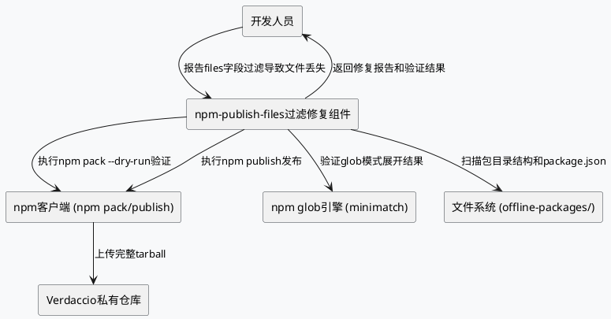
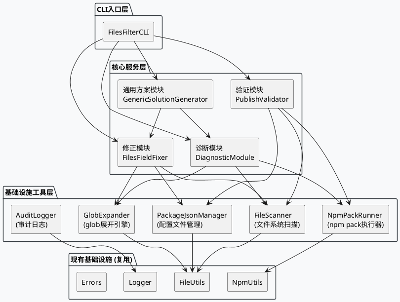
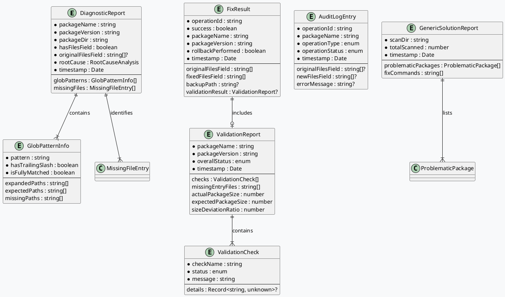

# **1. 实现模型**

## **1.1 上下文视图**

### 系统上下文

本组件在现有npm-install项目管理系统中运行，与以下外部系统交互：



### 部署约束

| 约束项 | 说明 |
|--------|------|
| 运行环境 | Node.js 16+，Windows平台为主 |
| 包目录位置 | `offline-packages/` 目录下的各子目录 |
| 配置文件 | 每个包的 `package.json` 中的 `files` 字段 |
| npm版本兼容 | npm 6.x 及以上 |

## **1.2 服务/组件总体架构**

### 架构分层



### 模块职责

| 模块 | 职责 | 输入 | 输出 |
|------|------|------|------|
| **DiagnosticModule** | 诊断files字段glob匹配问题，定位文件丢失根因 | 包目录路径 | `DiagnosticReport` |
| **FilesFieldFixer** | 修正package.json的files字段，将glob模式替换为显式目录列表 | 包目录路径、修正选项 | `FixResult` |
| **PublishValidator** | 验证npm publish后发布包的完整性 | 包目录路径 | `ValidationReport` |
| **GenericSolutionGenerator** | 扫描多个包识别同类问题，生成批量修复方案 | offline-packages目录路径 | `GenericSolutionReport` |
| **GlobExpander** | 展开files字段中的glob模式为显式路径列表 | glob模式字符串、包目录路径 | 展开后的路径列表 |
| **NpmPackRunner** | 执行npm pack --dry-run获取预期发布文件列表 | 包目录路径 | `PackResult` |
| **PackageJsonManager** | 读写package.json，创建备份和回滚 | 包目录路径 | 读取/写入结果 |
| **FileScanner** | 扫描本地文件系统获取实际文件结构 | 包目录路径 | 文件清单和统计信息 |
| **AuditLogger** | 记录修复操作的完整审计日志 | 操作事件 | 日志记录 |

## **1.3 实现设计文档**

### 1.3.1 DiagnosticModule（诊断模块）

#### 核心类型定义

```typescript
/** 诊断报告 */
interface DiagnosticReport {
  packageName: string;
  packageVersion: string;
  packageDir: string;
  hasFilesField: boolean;
  originalFilesField: string[] | undefined;
  globPatterns: GlobPatternInfo[];
  localDirectoryStructure: DirectoryEntry[];
  packFileList: string[];
  missingFiles: MissingFileEntry[];
  rootCause: RootCauseAnalysis;
  timestamp: Date;
}

/** glob模式信息 */
interface GlobPatternInfo {
  pattern: string;              // 原始glob模式，如 "dist-*/"
  hasTrailingSlash: boolean;    // 是否带尾部斜杠
  expandedPaths: string[];      // glob展开后的路径列表
  expectedPaths: string[];      // 基于本地文件系统预期的路径列表
  isFullyMatched: boolean;      // 展开结果是否与预期一致
  missingPaths: string[];       // 缺失的路径
}

/** 目录条目 */
interface DirectoryEntry {
  relativePath: string;
  isDirectory: boolean;
  size: number;
}

/** 缺失文件条目 */
interface MissingFileEntry {
  relativePath: string;
  directory: string;            // 所属的dist-*目录
  isEntryPoint: boolean;        // 是否为入口文件(main/module/types)
}

/** 根因分析 */
interface RootCauseAnalysis {
  problemType: 'files_glob_mismatch' | 'no_files_field' | 'npm_pack_error' | 'unknown';
  description: string;
  affectedPatterns: string[];
  confidence: number;           // 0-1，分析置信度
}
```

#### 诊断流程

```
1. 读取package.json，检查files字段是否存在
2. 解析files字段，识别所有包含glob通配符(*、**、?)的模式
3. 对每个glob模式，使用GlobExpander展开并与本地文件系统对比
4. 执行npm pack --dry-run获取实际发布文件列表
5. 对比本地文件与发布文件，计算缺失文件清单
6. 定位根因：files字段glob匹配不完整
7. 生成诊断报告
```

#### 关键算法：glob模式识别

```typescript
// 识别files字段中包含glob通配符的条目
function identifyGlobPatterns(filesField: string[]): GlobPatternInfo[] {
  const GLOB_CHARS = ['*', '?', '[', '{'];
  return filesField
    .filter(entry => GLOB_CHARS.some(char => entry.includes(char)))
    .map(pattern => ({
      pattern,
      hasTrailingSlash: pattern.endsWith('/'),
      expandedPaths: [],     // 待GlobExpander填充
      expectedPaths: [],     // 待FileScanner填充
      isFullyMatched: false,
      missingPaths: []
    }));
}
```

### 1.3.2 FilesFieldFixer（修正模块）

#### 核心类型定义

```typescript
/** 修正选项 */
interface FilesFixOptions {
  dryRun: boolean;              // 干运行模式，不实际修改文件
  createBackup: boolean;        // 是否创建备份
  preserveNonGlobEntries: boolean; // 是否保留非glob条目
  skipValidation: boolean;      // 是否跳过修正后的验证
}

/** 修正结果 */
interface FixResult {
  success: boolean;
  packageName: string;
  packageVersion: string;
  originalFilesField: string[];
  fixedFilesField: string[];
  backupPath: string | undefined;
  validationResult: ValidationReport | undefined;
  rollbackPerformed: boolean;
  operationId: string;          // 唯一操作ID
  timestamp: Date;
}
```

#### 修正流程

```
1. 读取并解析package.json
2. 创建package.json备份 (package.json.bak)
3. 识别files字段中的glob模式
4. 对每个glob模式，在本地文件系统中扫描匹配的目录
5. 生成显式目录列表替换glob模式
6. 保留非glob条目不变
7. 写入修正后的package.json
8. 触发PublishValidator验证
9. 验证失败则回滚到备份
10. 记录审计日志
11. 返回修正结果
```

#### 关键算法：glob模式展开为显式目录

```typescript
// 将glob模式展开为本地文件系统中实际存在的目录列表
function expandGlobToExplicitDirs(
  globPattern: string,
  packageDir: string,
  localDirs: string[]
): string[] {
  // 示例: globPattern="dist-*/", localDirs=["dist-node","dist-types","dist-web","bin"]
  // 1. 提取glob前缀: "dist-"
  const prefix = extractGlobPrefix(globPattern); // "dist-"
  
  // 2. 筛选本地匹配的目录
  const matchedDirs = localDirs.filter(dir => dir.startsWith(prefix));
  // matchedDirs = ["dist-node", "dist-types", "dist-web"]
  
  // 3. 添加尾部斜杠（如果原模式带尾部斜杠）
  const hasTrailingSlash = globPattern.endsWith('/');
  const result = matchedDirs.map(dir => hasTrailingSlash ? `${dir}/` : dir);
  // result = ["dist-node/", "dist-types/", "dist-web/"]
  
  return result;
}
```

### 1.3.3 PublishValidator（验证模块）

#### 核心类型定义

```typescript
/** 验证报告 */
interface ValidationReport {
  packageName: string;
  packageVersion: string;
  overallStatus: 'passed' | 'failed' | 'skipped';
  checks: ValidationCheck[];
  packResult: PackResult | undefined;
  missingEntryFiles: string[];
  actualPackageSize: number;    // KB
  expectedPackageSize: number;  // KB
  sizeDeviationRatio: number;   // 偏差比
  timestamp: Date;
}

/** 单项校验 */
interface ValidationCheck {
  checkName: string;
  status: 'passed' | 'failed' | 'skipped';
  message: string;
  details?: Record<string, unknown>;
}

/** npm pack执行结果 */
interface PackResult {
  fileCount: number;
  fileList: string[];
  packageSize: number;          // KB
  executionTime: number;        // ms
}
```

#### 验证检查项

| 检查项 | 检查内容 | 失败条件 |
|--------|----------|----------|
| `dist_dirs_completeness` | 所有dist-*目录是否包含在tarball中 | 任一dist-*目录缺失 |
| `entry_files_existence` | main/module/types入口文件是否存在 | 任一入口文件缺失 |
| `file_count_consistency` | 发布文件数量是否与预期一致 | 偏差超过20% |
| `package_size_reasonable` | 发布包大小是否在合理范围 | 偏差超过30% |
| `no_unexpected_exclusions` | 无非预期的文件排除 | 关键文件被排除 |

#### 验证流程

```
1. 执行npm pack --dry-run获取tarball内容列表
2. 校验dist-*目录完整性
3. 校验入口文件(main/module/types)存在性
4. 校验文件数量一致性
5. 校验包大小合理性
6. 汇总验证结果
7. 验证通过则允许npm publish
8. 验证失败则返回缺失文件清单
```

### 1.3.4 GenericSolutionGenerator（通用方案生成模块）

#### 核心类型定义

```typescript
/** 通用方案报告 */
interface GenericSolutionReport {
  scanDir: string;
  totalScanned: number;
  problematicPackages: ProblematicPackage[];
  fixCommands: string[];        // 批量修复命令列表
  timestamp: Date;
}

/** 问题包信息 */
interface ProblematicPackage {
  packageName: string;
  packageVersion: string;
  packageDir: string;
  globPatterns: string[];
  suggestedFix: string[];       // 建议的files字段值
}
```

#### 扫描流程

```
1. 遍历offline-packages/目录下所有子目录
2. 对每个子目录检查package.json是否存在
3. 解析files字段，识别使用glob通配符的条目
4. 对有glob模式的包，生成修正建议
5. 汇总所有问题包，生成批量修复方案
```

### 1.3.5 GlobExpander（glob展开引擎）

#### 核心设计

GlobExpander是本方案的核心组件，负责将files字段中的glob模式在本地文件系统上展开为显式路径列表。其设计需要考虑以下关键因素：

1. **尾部斜杠语义**：`dist-*/` 只匹配目录，`dist-*` 可匹配文件和目录
2. **前缀匹配**：提取glob模式的前缀（如`dist-`），在本地目录中筛选匹配项
3. **与npm glob引擎的一致性**：展开结果必须与npm内部glob引擎的行为一致

```typescript
interface GlobExpander {
  /**
   * 展开glob模式为显式路径列表
   * @param pattern - glob模式，如 "dist-*/"
   * @param packageDir - 包目录的绝对路径
   * @returns 展开后的路径列表（相对路径）
   */
  expand(pattern: string, packageDir: string): string[];
  
  /**
   * 验证展开结果是否与本地文件系统一致
   * @param pattern - glob模式
   * @param expandedPaths - 展开后的路径
   * @param packageDir - 包目录
   * @returns 验证结果
   */
  verifyExpansion(pattern: string, expandedPaths: string[], packageDir: string): ExpansionVerification;
}

interface ExpansionVerification {
  isConsistent: boolean;
  localMatches: string[];      // 本地文件系统实际匹配
  expandedMatches: string[];   // glob展开匹配
  missingInExpansion: string[]; // 展开中缺失的
  extraInExpansion: string[];   // 展开中多余的
}
```

#### 展开算法

```
输入: pattern="dist-*/", packageDir="/path/to/async-validator@4.2.5"

1. 解析pattern:
   - 前缀: "dist-"
   - 通配符: "*" (匹配目录名的剩余部分)
   - 后缀: "/" (目录标记)

2. 扫描packageDir的顶层目录:
   - dist-node/ → 匹配 (以"dist-"开头)
   - dist-types/ → 匹配 (以"dist-"开头)
   - dist-web/ → 匹配 (以"dist-"开头)
   - LICENSE.md → 不匹配

3. 输出: ["dist-node/", "dist-types/", "dist-web/"]
```

### 1.3.6 NpmPackRunner（npm pack执行器）

#### 核心设计

```typescript
interface NpmPackRunner {
  /**
   * 执行npm pack --dry-run并解析输出
   * @param packageDir - 包目录路径
   * @param timeout - 超时时间(ms)，默认30000
   * @returns pack结果
   */
  dryRun(packageDir: string, timeout?: number): Promise<PackResult>;
  
  /**
   * 执行实际的npm pack生成tgz文件
   * @param packageDir - 包目录路径
   * @param outputDir - 输出目录
   * @returns tgz文件路径
   */
  pack(packageDir: string, outputDir: string): Promise<string>;
}
```

#### npm pack --dry-run 输出解析

npm pack --dry-run 的输出格式示例：
```
npm notice 
npm notice Tarball Contents: 
npm notice 35 B  package.json
npm notice 1.1kB dist-node/index.js
npm notice ...
npm notice Tarball Details: 
npm notice filename: async-validator-4.2.5.tgz
npm notice package size: 285 kB
npm notice unpacked size: 35 kB
npm notice 35 files
```

解析策略：提取`Tarball Contents`部分的所有文件路径，以及`package size`和文件数量。

### 1.3.7 PackageJsonManager（配置文件管理器）

#### 核心设计

```typescript
interface PackageJsonManager {
  /** 读取package.json */
  read(packageDir: string): Promise<PackageJsonContent>;
  
  /** 写入package.json（修改files字段） */
  write(packageDir: string, content: PackageJsonContent): Promise<void>;
  
  /** 创建备份 package.json.bak */
  createBackup(packageDir: string): Promise<string>;
  
  /** 从备份回滚 */
  rollback(packageDir: string): Promise<boolean>;
  
  /** 检查备份是否存在 */
  hasBackup(packageDir: string): Promise<boolean>;
  
  /** 更新files字段 */
  updateFilesField(packageDir: string, newFilesField: string[]): Promise<void>;
}

interface PackageJsonContent {
  name: string;
  version: string;
  files?: string[];
  main?: string;
  module?: string;
  types?: string;
  bin?: Record<string, string> | string;
  [key: string]: unknown;       // 其他字段
}
```

### 1.3.8 AuditLogger（审计日志）

#### 核心设计

```typescript
/** 审计日志条目 */
interface AuditLogEntry {
  operationId: string;          // 唯一操作ID
  packageName: string;
  packageVersion: string;
  operationType: 'diagnose' | 'fix' | 'validate' | 'rollback' | 'publish';
  operationStatus: 'started' | 'completed' | 'failed';
  originalFilesField?: string[];
  newFilesField?: string[];
  validationResult?: ValidationReport;
  errorMessage?: string;
  timestamp: Date;
}

interface AuditLogger {
  /** 记录操作开始 */
  logStart(entry: Omit<AuditLogEntry, 'operationStatus' | 'timestamp'>): void;
  
  /** 记录操作完成 */
  logComplete(operationId: string, result?: Partial<AuditLogEntry>): void;
  
  /** 记录操作失败 */
  logFailure(operationId: string, error: string): void;
  
  /** 查询操作历史 */
  queryHistory(packageName: string, packageVersion: string): AuditLogEntry[];
}
```

# **2. 接口设计**

## **2.1 总体设计**

本组件对外提供两种接口形式：
1. **CLI命令行接口**：供开发人员直接通过命令行使用
2. **程序化API接口**：供其他模块或脚本集成调用

接口设计原则：
- 所有公开接口均有明确的TypeScript类型定义
- 输入参数均做校验，非法输入抛出`ValidationError`
- 异步操作均返回Promise，支持超时控制
- 修改操作均支持`dryRun`模式

## **2.2 接口清单**

### CLI接口

| 命令 | 参数 | 说明 |
|------|------|------|
| `npm run fix-files` | `[--package <dir>] [--all] [--dry-run] [--no-backup] [--skip-validation]` | 修正files字段 |
| `npm run diagnose-files` | `[--package <dir>] [--all]` | 诊断files字段问题 |
| `npm run validate-publish` | `[--package <dir>] [--all]` | 验证发布完整性 |
| `npm run scan-files-issues` | `[--dir <offline-packages>]` | 扫描所有包的files字段问题 |

### 程序化API接口

```typescript
/** 主入口类 */
class FilesFilterFixer {
  /** 诊断单个包的files字段问题 */
  diagnose(packageDir: string): Promise<DiagnosticReport>;
  
  /** 诊断所有包 */
  diagnoseAll(offlinePackagesDir: string): Promise<DiagnosticReport[]>;
  
  /** 修正单个包的files字段 */
  fix(packageDir: string, options?: Partial<FilesFixOptions>): Promise<FixResult>;
  
  /** 修正所有问题包 */
  fixAll(offlinePackagesDir: string, options?: Partial<FilesFixOptions>): Promise<FixResult[]>;
  
  /** 验证单个包的发布完整性 */
  validate(packageDir: string): Promise<ValidationReport>;
  
  /** 验证所有包 */
  validateAll(offlinePackagesDir: string): Promise<ValidationReport[]>;
  
  /** 扫描并生成通用修复方案 */
  scanAndGenerateSolution(offlinePackagesDir: string): Promise<GenericSolutionReport>;
  
  /** 回滚修正操作 */
  rollback(packageDir: string): Promise<boolean>;
}
```

# **4. 数据模型**

## **4.1 设计目标**

1. **类型安全**：所有数据结构使用TypeScript接口严格定义，禁止使用`any`
2. **不可变性**：核心数据模型（DiagnosticReport、FixResult、ValidationReport）一旦创建即为不可变对象
3. **可追溯性**：每个修复操作关联唯一操作ID，支持审计查询
4. **可序列化**：所有数据模型支持JSON序列化，用于报告生成和持久化

## **4.2 模型实现**

### 4.2.1 核心实体关系



### 4.2.2 package.json备份模型

备份文件以`package.json.bak`命名，存放在原包目录下，内容为JSON格式的完整package.json原始内容。

```
offline-packages/async-validator@4.2.5/
├── package.json          # 修正后的: files: ["dist-node/", "dist-types/", "dist-web/", "bin/"]
├── package.json.bak      # 原始备份: files: ["dist-*/", "bin/"]
├── dist-node/
├── dist-types/
├── dist-web/
├── LICENSE.md
└── README.md
```

### 4.2.3 修复操作记录模型

修复操作记录以JSON文件存储于项目根目录，路径为`files-fix-report.json`：

```typescript
interface FilesFixReport {
  generatedAt: Date;
  totalScanned: number;
  totalFixed: number;
  totalFailed: number;
  results: FixResult[];
  diagnosticReports: DiagnosticReport[];
}
```

### 4.2.4 枚举类型定义

```typescript
/** 验证状态 */
type ValidationStatus = 'passed' | 'failed' | 'skipped';

/** 修复操作状态 */
type FixOperationStatus = 'success' | 'failed-rolled-back' | 'failed-not-rolled-back';

/** 根因问题类型 */
type ProblemType = 'files_glob_mismatch' | 'no_files_field' | 'npm_pack_error' | 'unknown';

/** 审计操作类型 */
type AuditOperationType = 'diagnose' | 'fix' | 'validate' | 'rollback' | 'publish';

/** 审计操作状态 */
type AuditOperationStatus = 'started' | 'completed' | 'failed';
```
