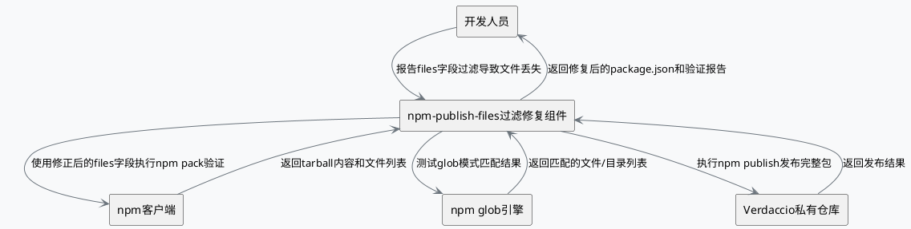
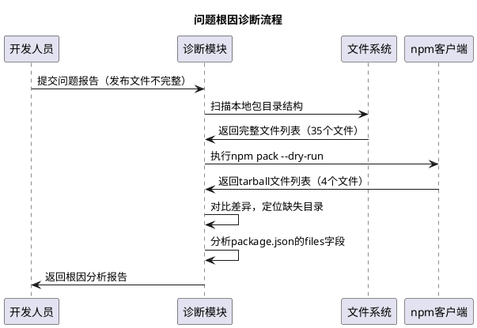
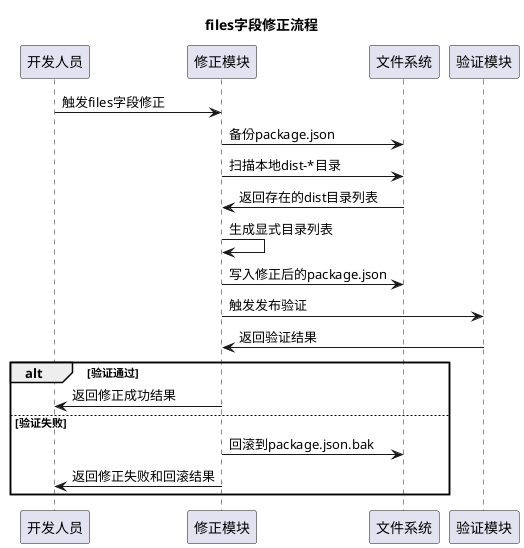
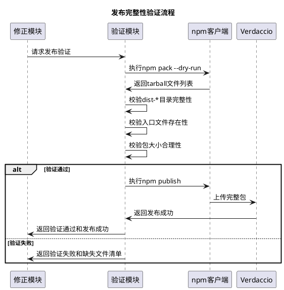
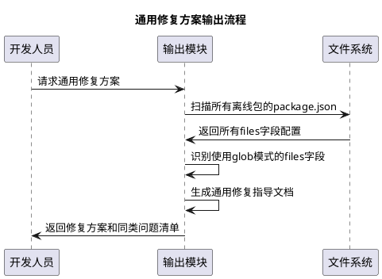

# **1. 组件定位**

## **1.1 核心职责**

本组件负责修复npm publish过程中因package.json的files字段glob模式匹配不完整导致发布文件丢失的问题，确保离线包发布到私有仓库时包含完整的构建产物。

## **1.2 核心输入**

1. 用户反馈：async-validator@4.2.5执行npm publish后dist-types/和dist-web/目录丢失的问题报告
2. package.json配置：包含files字段的包配置信息，其中files字段值为 `["dist-*/", "bin/"]`
3. 离线包目录：offline-packages/目录下的完整包文件结构（包含dist-node/、dist-types/、dist-web/）
4. npm publish输出：发布时的tarball内容和文件数量信息

## **1.3 核心输出**

1. 修复后的package.json：files字段经过修正后能确保所有dist-*目录被完整包含
2. 发布验证报告：确认npm publish后所有必要文件均包含在tarball中的验证结果
3. 修复指导文档：针对同类问题的通用修复方案和最佳实践

## **1.4 职责边界**

1. 不负责npm客户端本身的glob匹配逻辑修改（npm的内部行为不在控制范围内）
2. 不负责离线包源码的功能性修改或bug修复
3. 不负责Verdaccio私有仓库的存储和分发逻辑
4. 不负责除files字段外的其他package.json配置项的修改决策

# **2. 领域术语**

**files字段**
: package.json中的一个可选数组字段，用于指定npm publish时应包含在发布包中的文件或目录模式。未列出但始终包含的文件有：package.json、README（及其变体）、LICENSE/ licence（及其变体）、CHANGELOG（及其变体）。

**glob模式匹配**
: 使用通配符（如`*`、`**`）匹配文件或目录路径的模式语法。npm使用`glob`包（基于`minimatch`）对files字段中的模式进行展开匹配。

**dist-*目录**
: 以`dist-`为前缀的构建产物目录，在async-validator@4.2.5中包含dist-node/（CommonJS构建）、dist-types/（TypeScript类型声明）、dist-web/（ES Module构建）三个目录。

**npm publish**
: npm的发布命令，将包打包为tarball并上传到registry。打包时根据files字段、.npmignore文件和默认规则决定包含哪些文件。

**tarball**
: npm publish创建的压缩归档文件（.tgz格式），包含发布的所有包文件。npm publish的输出会显示tarball的内容列表和大小。

**尾部斜杠语义**
: 在files字段的glob模式中，尾部斜杠（如`dist-*/`）表示该模式只匹配目录而非文件。npm对尾部斜杠的处理在不同版本中可能存在行为差异。

# **3. 角色与边界**

## **3.1 核心角色**

开发人员：执行npm publish操作并验证发布结果，当发现发布文件不完整时提出问题反馈。
系统管理员：负责维护Verdaccio私有仓库的可用性，监控发布包的完整性。

## **3.2 外部系统**

npm客户端：执行npm publish命令，根据package.json的files字段和glob规则决定发布文件内容。
Verdaccio私有仓库：接收并存储npm publish上传的包，作为离线环境的npm registry。
npm glob引擎：npm内部使用的glob匹配库（基于minimatch），负责展开files字段中的通配符模式。

## **3.3 交互上下文**

# **4. DFX约束**

## **4.1 性能**

1. files字段修正操作必须在10秒内完成
2. npm pack验证操作必须在30秒内完成
3. 完整的npm publish操作必须在60秒内完成

## **4.2 可靠性**

1. 修复后的files字段必须确保所有dist-*目录被完整包含在发布包中
2. 修复方案必须经过npm pack验证后才可执行npm publish
3. 必须保留原始package.json的备份，修复失败时可回滚

## **4.3 安全性**

1. 修改package.json前必须创建备份
2. 修复操作不得引入非预期的文件到发布包中
3. 必须记录所有修复操作的过程和结果

## **4.4 可维护性**

1. 修复方案必须可适用于其他存在相同files字段问题的离线包
2. 必须提供清晰的修复步骤文档
3. 修复状态必须可追溯和可验证

## **4.5 兼容性**

1. 修复后的package.json必须与npm 6.x及以上版本兼容
2. 修复方案不得改变包的版本号和API接口
3. 修复后的发布包必须与原包的运行时行为完全一致

# **5. 核心能力**

## **5.1 问题根因诊断**

### **5.1.1 业务规则**

1. **files字段glob匹配规则**：当package.json的files字段包含带尾部斜杠的glob模式（如`dist-*/`）时，npm在打包过程中使用glob引擎展开该模式，只将匹配到的目录及其内容包含在tarball中
   a. 验收条件：When package.json的files字段包含`dist-*/`模式，the npm publish流程 shall 使用glob引擎将`dist-*/`展开为所有匹配的dist前缀目录

2. **尾部斜杠匹配差异规则**：npm的glob引擎对尾部斜杠的处理存在版本差异，`dist-*/`模式在某些npm版本中可能只匹配部分dist-*目录，而非全部
   a. 验收条件：When npm客户端使用特定glob引擎版本处理`dist-*/`模式，the glob引擎 shall 将模式展开为本地文件系统中所有匹配的dist-*目录（包括dist-node/、dist-types/、dist-web/）

3. **文件丢失确认规则**：系统必须能够识别npm publish实际包含的文件与预期包含的文件之间的差异
   a. 验收条件：When npm publish输出显示tarball仅包含4个文件（而本地目录包含35个文件），the 诊断模块 shall 确认dist-types/和dist-web/目录未被包含

4. **根因定位规则**：系统必须将文件丢失问题定位到package.json的files字段配置
   a. 验收条件：When 确认发布文件不完整，the 诊断模块 shall 定位根因为files字段的glob模式匹配不完整

### **5.1.2 交互流程**

### **5.1.3 异常场景**

1. **npm pack执行失败**
   a. 触发条件：npm pack --dry-run命令执行出错
   b. 系统行为：记录错误信息，回退为手动对比本地文件与package.json配置
   c. 用户感知：显示"npm pack验证失败，请手动检查files字段配置"

2. **package.json中无files字段**
   a. 触发条件：package.json未配置files字段
   b. 系统行为：标记此包不适用files字段过滤问题，按.npmignore规则分析
   c. 用户感知：显示"该包未使用files字段过滤，问题可能由其他原因导致"

## **5.2 files字段修正**

### **5.2.1 业务规则**

1. **显式列举修正规则**：将files字段中的glob模式`dist-*/`替换为显式的目录列表，确保每个dist-*目录都被明确包含
   a. 验收条件：When package.json的files字段为`["dist-*/", "bin/"]`且本地存在dist-node/、dist-types/、dist-web/三个目录，the 修正模块 shall 将files字段更新为`["dist-node/", "dist-types/", "dist-web/", "bin/"]`

2. **保留非glob条目规则**：修正files字段时，必须保留所有非glob模式的条目不变
   a. 验收条件：When files字段包含非glob条目`bin/`，the 修正模块 shall 在修正后保留`bin/`条目不变

3. **空目录处理规则**：当glob模式匹配到本地不存在的目录时，不应将其添加到修正后的files字段中
   a. 验收条件：When glob模式`dist-*/`匹配但本地不存在`dist-xxx/`目录，the 修正模块 shall 不将`dist-xxx/`添加到files字段

4. **备份规则**：修正前必须创建package.json的备份
   a. 验收条件：When 执行files字段修正，the 修正模块 shall 先将原始package.json复制为package.json.bak

5. **回滚规则**：当修正后验证失败时，必须能够回滚到原始package.json
   a. 验收条件：When 验证修正后发布结果仍不完整，the 修正模块 shall 使用package.json.bak恢复原始配置

### **5.2.2 交互流程**

### **5.2.3 异常场景**

1. **目录扫描失败**
   a. 触发条件：无法读取本地包目录结构
   b. 系统行为：记录错误日志，终止修正操作
   c. 用户感知：显示"无法扫描包目录，请检查文件权限"

2. **写入package.json失败**
   a. 触发条件：写入修正后的package.json时权限不足或磁盘空间不足
   b. 系统行为：回滚到备份文件，报告写入错误
   c. 用户感知：显示"package.json写入失败，已恢复原始配置"

3. **所有dist-*目录均不存在**
   a. 触发条件：本地不存在任何dist-*目录
   b. 系统行为：标记该包可能未构建，不执行修正
   c. 用户感知：显示"未找到构建产物目录，请先执行构建"

## **5.3 发布完整性验证**

### **5.3.1 业务规则**

1. **npm pack预检规则**：执行npm publish前必须先通过npm pack验证发布文件列表的完整性
   a. 验收条件：When 准备执行npm publish，the 验证模块 shall 先执行npm pack --dry-run获取预期发布的文件列表

2. **文件完整性校验规则**：验证npm pack的输出文件列表必须包含所有必要的构建产物目录
   a. 验收条件：When async-validator@4.2.5执行npm pack，the 验证模块 shall 确认tarball包含dist-node/、dist-types/、dist-web/三个目录的所有文件

3. **文件数量校验规则**：验证npm pack的输出文件数量必须与本地包目录的预期文件数量一致
   a. 验收条件：When async-validator@4.2.5的本地目录包含35个文件，the 验证模块 shall 确认npm pack输出的文件数量与预期一致（排除devDependencies等非发布文件后）

4. **关键入口文件校验规则**：验证发布包必须包含package.json中main、module、types字段指向的入口文件
   a. 验收条件：When package.json声明了`"main": "dist-node/index.js"`、`"module": "dist-web/index.js"`、`"types": "dist-types/index.d.ts"`，the 验证模块 shall 确认这三个入口文件均存在于tarball中

5. **包大小校验规则**：验证发布包的大小必须在合理范围内，与预期值无显著偏差
   a. 验收条件：When async-validator@4.2.5的预期包大小约285KB，the 验证模块 shall 确认实际发布包大小不低于200KB（允许一定容差）

### **5.3.2 交互流程**

### **5.3.3 异常场景**

1. **npm pack超时**
   a. 触发条件：npm pack --dry-run执行超过30秒未完成
   b. 系统行为：终止验证，标记为超时失败
   c. 用户感知：显示"npm pack验证超时，请检查npm配置"

2. **入口文件缺失**
   a. 触发条件：tarball中缺少package.json的main/module/types字段指向的文件
   b. 系统行为：列出缺失的入口文件，标记验证失败
   c. 用户感知：显示"关键入口文件缺失：[缺失文件列表]，发布中止"

3. **Verdaccio上传失败**
   a. 触发条件：npm publish上传到Verdaccio失败
   b. 系统行为：记录上传错误，保留本地修正结果供重试
   c. 用户感知：显示"上传到私有仓库失败，请检查Verdaccio服务状态"

## **5.4 通用修复方案输出**

### **5.4.1 业务规则**

1. **方案文档化规则**：修复方案必须输出为可复用的指导文档，包含问题识别、诊断步骤、修正方法和验证方法
   a. 验收条件：When 修复流程完成，the 输出模块 shall 生成包含完整修复步骤的文档

2. **同类问题识别规则**：系统必须能够扫描其他离线包是否存在相同的files字段glob匹配问题
   a. 验收条件：When 扫描offline-packages/目录下所有包，the 扫描模块 shall 识别所有在files字段中使用glob通配符模式的package.json

3. **批量修正建议规则**：对识别出的同类问题包，系统必须提供批量修正建议
   a. 验收条件：When 发现多个包存在相同的files字段glob问题，the 输出模块 shall 生成批量修正方案

### **5.4.2 交互流程**

### **5.4.3 异常场景**

1. **无同类问题包**
   a. 触发条件：扫描后发现只有async-validator@4.2.5存在此问题
   b. 系统行为：输出仅针对此包的修复方案
   c. 用户感知：显示"仅async-validator@4.2.5存在files字段glob匹配问题"

2. **包目录结构异常**
   a. 触发条件：某些离线包目录缺少package.json
   b. 系统行为：跳过该包，记录警告日志
   c. 用户感知：显示"部分包缺少package.json，已跳过检查"

# **6. 数据约束**

## **6.1 files字段配置**

1. **原始值**：必须记录files字段的原始值，用于回滚和审计
2. **修正后值**：必须为显式目录数组，禁止包含glob通配符（`*`、`**`、`?`等）
3. **条目格式**：每个条目必须以`/`结尾表示目录，或为具体文件路径
4. **保留条目**：修正时必须保留原始配置中的非glob条目

## **6.2 包文件清单**

1. **本地文件列表**：必须完整记录本地包目录中的所有文件和目录结构
2. **发布文件列表**：必须记录npm pack/publish实际包含的文件列表
3. **缺失文件列表**：必须记录本地存在但未包含在发布包中的文件路径
4. **文件总数**：必须记录本地文件总数和发布文件总数的差值

## **6.3 验证结果**

1. **验证状态**：必须为"通过"、"失败"、"跳过"三者之一
2. **缺失入口文件**：当验证失败时，必须列出缺失的main/module/types入口文件
3. **实际包大小**：必须记录npm pack/publish后的包大小（KB）
4. **预期包大小**：必须记录基于本地文件计算的预期包大小（KB）
5. **大小偏差比**：当实际包大小与预期包大小偏差超过30%时，必须标记为异常

## **6.4 修复操作记录**

1. **操作ID**：必须为唯一标识符
2. **包名称**：修复的目标包名称和版本号
3. **files字段原始值**：修正前的files字段完整内容
4. **files字段修正值**：修正后的files字段完整内容
5. **验证结果**：修复后的发布验证结果
6. **操作时间**：修复操作完成的时间戳
7. **操作状态**：必须为"成功"、"失败-已回滚"、"失败-未回滚"三者之一
