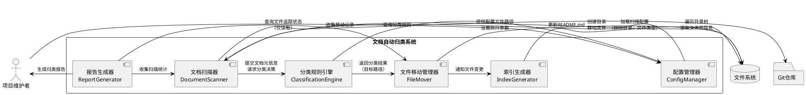
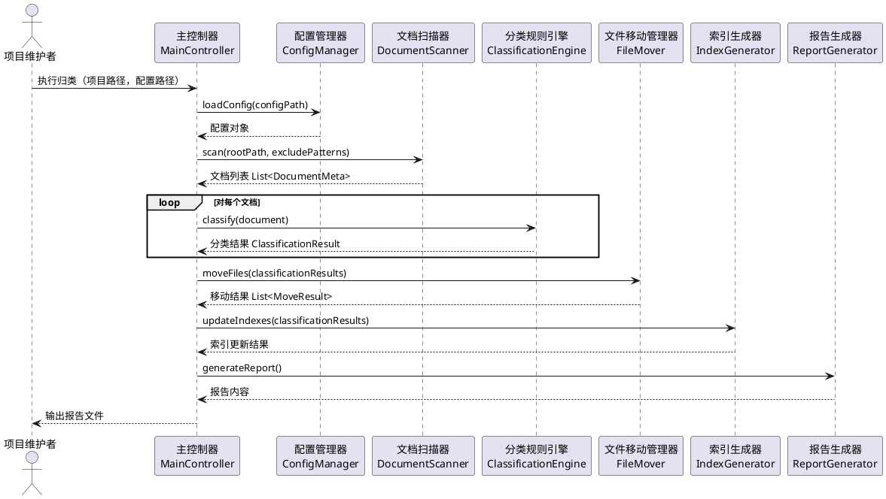

# **1. 实现模型**

## **1.1 上下文视图**

### 系统边界与外部交互



### 核心流程时序



---

## **1.2 服务/组件总体架构**

### 架构分层设计

```
┌─────────────────────────────────────────────────────────────────┐
│                        应用层 (Application)                      │
│  ┌───────────────────────────────────────────────────────────┐  │
│  │  MainController - 主控制器，协调各组件执行流程                 │  │
│  │  CLI - 命令行界面，接收用户输入和参数                          │  │
│  └───────────────────────────────────────────────────────────┘  │
└─────────────────────────────────────────────────────────────────┘
                              ↓
┌─────────────────────────────────────────────────────────────────┐
│                        业务层 (Business)                         │
│  ┌───────────────────────────────────────────────────────────┐  │
│  │  DocumentScanner - 文档扫描，元信息提取                        │  │
│  │  ClassificationEngine - 分类决策，规则匹配                     │  │
│  │  FileMover - 文件移动，冲突检测，备份管理                       │  │
│  │  IndexGenerator - 索引生成，链接构建                           │  │
│  └───────────────────────────────────────────────────────────┘  │
└─────────────────────────────────────────────────────────────────┘
                              ↓
┌─────────────────────────────────────────────────────────────────┐
│                        基础层 (Infrastructure)                   │
│  ┌───────────────────────────────────────────────────────────┐  │
│  │  ConfigManager - 配置文件加载和验证                           │  │
│  │  FileSystem - 文件系统操作封装（读、写、移动、目录创建）        │  │
│  │  GitHelper - Git状态查询（只读）                               │  │
│  │  Logger - 日志记录器                                          │  │
│  └───────────────────────────────────────────────────────────┘  │
└─────────────────────────────────────────────────────────────────┘
                              ↓
┌─────────────────────────────────────────────────────────────────┐
│                        数据层 (Data)                             │
│  ┌───────────────────────────────────────────────────────────┐  │
│  │  分类规则配置文件 (classify-rules.yaml)                        │  │
│  │  归类报告文件 (classify-report-{timestamp}.md)                │  │
│  │  备份目录 (_classify_backup_{timestamp}/)                     │  │
│  └───────────────────────────────────────────────────────────┐  │
└─────────────────────────────────────────────────────────────────┘
```

### 组件职责矩阵

| 组件名称 | 核心职责 | 输入 | 输出 | 依赖组件 |
|---------|---------|------|------|---------|
| **MainController** | 协调执行流程，管理整体生命周期 | 配置路径、项目路径 | 执行报告 | Scanner, Engine, Mover, Indexer, Reporter |
| **DocumentScanner** | 扫描项目目录，识别和提取文档元信息 | 根路径、排除规则 | 文档元信息列表 | FileSystem, Logger |
| **ClassificationEngine** | 根据规则匹配文档分类 | 文档元信息、规则配置 | 分类结果 | ConfigManager, Logger |
| **FileMover** | 执行文件移动，处理冲突和备份 | 分类结果列表 | 移动结果列表 | FileSystem, GitHelper, Logger |
| **IndexGenerator** | 生成和更新分类索引文件 | 分类结果、文档列表 | 索引文件内容 | FileSystem, Logger |
| **ReportGenerator** | 汇总执行结果，生成可读报告 | 扫描统计、移动记录 | 报告Markdown内容 | Logger |
| **ConfigManager** | 加载、验证和提供配置数据 | 配置文件路径 | 配置对象 | FileSystem, Logger |
| **FileSystem** | 封装文件系统操作 | 操作参数 | 操作结果 | - |
| **GitHelper** | 查询Git文件状态 | 文件路径 | Git状态信息 | - |

---

## **1.3 实现设计文档**

### 1.3.1 技术选型

| 技术项 | 选型方案 | 选型理由 |
|-------|---------|---------|
| **开发语言** | TypeScript 5.x | 强类型安全，IDE支持友好，适合复杂业务逻辑开发 |
| **运行时** | Node.js 18.x LTS | 项目已有Node.js环境，跨平台支持完善 |
| **配置格式** | YAML | 可读性强，支持注释，适合人类编辑的配置文件 |
| **CLI框架** | Commander.js | 成熟的Node.js CLI框架，支持子命令和参数解析 |
| **文件匹配** | fast-glob | 高性能glob匹配库，支持Windows路径 |
| **文件操作** | fs-extra | Node.js fs模块增强，支持Promise和递归操作 |
| **日志库** | winston | 功能完善的日志库，支持多输出目标 |
| **时间处理** | dayjs | 轻量级时间库，用于生成时间戳和报告 |
| **编码检测** | jschardet | 自动检测文件编码，处理非UTF-8文件 |

### 1.3.2 目录结构设计

```
md-classifier/
├── package.json                    # 项目配置
├── tsconfig.json                   # TypeScript配置
├── src/                            # 源代码目录
│   ├── index.ts                    # 入口文件
│   ├── cli.ts                      # CLI命令定义
│   ├── controllers/
│   │   └── MainController.ts       # 主控制器
│   ├── services/
│   │   ├── DocumentScanner.ts      # 文档扫描服务
│   │   ├── ClassificationEngine.ts # 分类规则引擎
│   │   ├── FileMover.ts            # 文件移动服务
│   │   ├── IndexGenerator.ts       # 索引生成服务
│   │   └── ReportGenerator.ts      # 报告生成服务
│   ├── infrastructure/
│   │   ├── ConfigManager.ts        # 配置管理
│   │   ├── FileSystem.ts           # 文件系统封装
│   │   ├── GitHelper.ts            # Git辅助工具
│   │   └── Logger.ts               # 日志管理
│   ├── models/
│   │   ├── DocumentMeta.ts         # 文档元信息模型
│   │   ├── ClassificationRule.ts   # 分类规则模型
│   │   ├── ClassificationResult.ts # 分类结果模型
│   │   ├── MoveResult.ts           # 移动结果模型
│   │   └── Config.ts               # 配置模型
│   └── utils/
│       ├── pathUtils.ts            # 路径处理工具
│       ├── stringUtils.ts          # 字符串处理工具
│       └── encodingUtils.ts        # 编码处理工具
├── config/
│   └── default-rules.yaml          # 默认分类规则配置
├── dist/                           # 编译输出目录
└── README.md                       # 使用说明
```

### 1.3.3 核心算法设计

#### 算法1：文档扫描与元信息提取

```
算法：scanDocuments(rootPath, excludePatterns)
输入：项目根路径，排除模式列表
输出：文档元信息列表

1. 初始化空列表 documentList
2. 使用 fast-glob 扫描所有 .md 和 .markdown 文件
   - 模式：**/*.md, **/*.markdown
   - 忽略：excludePatterns + 默认排除（.git, node_modules, .env等）
3. 对每个匹配的文件路径 filePath：
   a. 读取文件统计信息（大小、创建时间、修改时间）
   b. 检测文件编码（使用 jschardet）
   c. 读取文件前100行内容
   d. 提取首个一级标题（匹配 /^#\s+(.+)$/m）
   e. 构造 DocumentMeta 对象：
      - filePath: 绝对路径
      - fileName: 文件名（含扩展名）
      - title: 提取的标题或文件名
      - size: 文件大小
      - createdTime: 创建时间
      - modifiedTime: 修改时间
      - encoding: 编码格式
   f. 追加到 documentList
4. 返回 documentList

时间复杂度：O(n)，n为文件数量
空间复杂度：O(n)，存储所有文档元信息
```

#### 算法2：分类规则匹配

```
算法：classifyDocument(document, rules)
输入：文档元信息，分类规则列表（已按优先级排序）
输出：分类结果

1. 对每条规则 rule（按优先级顺序）：
   a. 检查文件名关键词匹配：
      - 对 rule.filenameKeywords 中每个关键词：
        - 若 document.fileName 包含关键词（忽略大小写）：
          - 返回匹配结果：分类 = rule.category, 匹配规则 = rule.name
   b. 检查路径模式匹配：
      - 对 rule.pathPatterns 中每个模式：
        - 若 document.filePath 匹配 glob 模式：
          - 返回匹配结果：分类 = rule.category, 匹配规则 = rule.name
   c. 检查标题关键词匹配：
      - 若 document.title 不为空：
        - 对 rule.titleKeywords 中每个关键词：
          - 若 document.title 包含关键词（忽略大小写）：
            - 返回匹配结果：分类 = rule.category, 匹配规则 = rule.name
2. 若所有规则均不匹配：
   - 返回默认分类："未分类", 匹配规则 = null
```

#### 算法3：安全文件移动

```
算法：moveFileSafely(sourcePath, targetPath, options)
输入：源文件路径，目标路径，选项（是否安全模式、冲突策略）
输出：移动结果

1. 验证路径安全：
   - 检查 sourcePath 在项目根目录内
   - 检查 targetPath 在项目根目录内
   - 若任一检查失败，返回错误结果
2. 检查目标目录是否存在：
   - 若不存在，递归创建目录
3. 检查目标文件是否存在：
   - 若存在且冲突策略为 "skip"：
     - 返回跳过结果，记录冲突信息
   - 若存在且冲突策略为 "overwrite"：
     - 记录警告，继续执行
4. 若启用安全模式：
   - 创建备份目录 _classify_backup_{timestamp}
   - 复制 sourcePath 到备份目录
5. 执行文件移动：
   - 使用 fs.move(sourcePath, targetPath, { overwrite: false })
   - 捕获移动异常，返回错误结果
6. 返回成功结果
```

### 1.3.4 并发与性能设计

#### 性能优化策略

| 场景 | 优化方案 | 预期效果 |
|-----|---------|---------|
| **大量文件扫描** | 使用 fast-glob 异步流式扫描，批量处理结果 | 1000文件扫描时间 < 10秒 |
| **文件内容读取** | 仅读取前100行，使用流式读取避免全文件加载 | 单文件读取时间 < 100ms |
| **规则匹配** | 规则预编译为正则，使用短路评估优化 | 单文档匹配时间 < 5ms |
| **批量文件移动** | 按目标目录分组，减少目录创建次数 | 100文件移动时间 < 5秒 |

#### 并发控制

```typescript
// 使用 Promise.allSettled 控制并发
const CONCURRENCY_LIMIT = 10; // 并发限制

async function batchProcess<T, R>(
  items: T[],
  processor: (item: T) => Promise<R>,
  limit: number = CONCURRENCY_LIMIT
): Promise<PromiseSettledResult<R>[]> {
  const results: PromiseSettledResult<R>[] = [];
  
  for (let i = 0; i < items.length; i += limit) {
    const batch = items.slice(i, i + limit);
    const batchResults = await Promise.allSettled(
      batch.map(item => processor(item))
    );
    results.push(...batchResults);
  }
  
  return results;
}
```

---

# **2. 接口设计**

## **2.1 总体设计**

### 设计原则

1. **单一职责**：每个接口只负责一个明确的业务能力
2. **输入验证**：所有公共方法必须验证输入参数的有效性
3. **错误处理**：使用 Result 模式返回成功或失败，避免抛出异常中断流程
4. **异步优先**：所有涉及I/O的操作必须返回 Promise
5. **不可变数据**：数据模型使用 readonly 修饰符，防止意外修改

### Result 模式定义

```typescript
interface Success<T> {
  success: true;
  data: T;
}

interface Failure {
  success: false;
  error: string;
  code: ErrorCode;
}

type Result<T> = Success<T> | Failure;
```

---

## **2.2 接口清单**

### 2.2.1 MainController - 主控制器

```typescript
interface MainController {
  /**
   * 执行完整的文档归类流程
   * @param options 执行选项
   * @returns 执行报告内容
   */
  execute(options: ExecuteOptions): Promise<Result<string>>;
}

interface ExecuteOptions {
  /** 项目根目录路径 */
  rootPath: string;
  /** 分类规则配置文件路径 */
  configPath?: string;
  /** 是否启用安全模式（创建备份） */
  safeMode?: boolean;
  /** 文件冲突处理策略 */
  conflictStrategy?: 'skip' | 'overwrite';
  /** 是否更新索引文件 */
  updateIndex?: boolean;
  /** 报告输出路径 */
  reportPath?: string;
  /** 是否输出详细日志 */
  verbose?: boolean;
}
```

---

### 2.2.2 DocumentScanner - 文档扫描服务

```typescript
interface DocumentScanner {
  /**
   * 扫描项目目录，识别所有Markdown文档
   * @param rootPath 项目根路径
   * @param excludePatterns 排除的目录或文件模式
   * @returns 文档元信息列表
   */
  scan(rootPath: string, excludePatterns: string[]): Promise<Result<DocumentMeta[]>>;
  
  /**
   * 提取单个文档的元信息
   * @param filePath 文件绝对路径
   * @returns 文档元信息
   */
  extractMeta(filePath: string): Promise<Result<DocumentMeta>>;
}

interface DocumentMeta {
  /** 文件绝对路径 */
  readonly filePath: string;
  /** 文件名（含扩展名） */
  readonly fileName: string;
  /** 文档标题（从一级标题提取） */
  readonly title: string;
  /** 文件大小（字节） */
  readonly size: number;
  /** 创建时间 */
  readonly createdTime: string;
  /** 修改时间 */
  readonly modifiedTime: string;
  /** 文件编码 */
  readonly encoding: string;
  /** 相对于项目根目录的相对路径 */
  readonly relativePath: string;
}
```

---

### 2.2.3 ClassificationEngine - 分类规则引擎

```typescript
interface ClassificationEngine {
  /**
   * 初始化分类引擎，加载规则配置
   * @param rules 分类规则列表
   */
  initialize(rules: ClassificationRule[]): void;
  
  /**
   * 对文档进行分类决策
   * @param document 文档元信息
   * @returns 分类结果
   */
  classify(document: DocumentMeta): ClassificationResult;
  
  /**
   * 批量分类文档
   * @param documents 文档列表
   * @returns 分类结果列表
   */
  classifyBatch(documents: DocumentMeta[]): ClassificationResult[];
}

interface ClassificationRule {
  /** 规则名称 */
  readonly name: string;
  /** 目标分类名称（对应目录名） */
  readonly category: string;
  /** 目标目录路径（相对于项目根） */
  readonly targetDir: string;
  /** 文件名关键词列表 */
  readonly filenameKeywords?: string[];
  /** 路径模式列表（glob格式） */
  readonly pathPatterns?: string[];
  /** 标题关键词列表 */
  readonly titleKeywords?: string[];
  /** 优先级（越小越高） */
  readonly priority: number;
}

interface ClassificationResult {
  /** 文档元信息 */
  readonly document: DocumentMeta;
  /** 分类名称 */
  readonly category: string;
  /** 目标目录路径 */
  readonly targetDir: string;
  /** 匹配的规则名称 */
  readonly matchedRule: string | null;
  /** 目标文件完整路径 */
  readonly targetPath: string;
}
```

---

### 2.2.4 FileMover - 文件移动服务

```typescript
interface FileMover {
  /**
   * 执行文件移动操作
   * @param results 分类结果列表
   * @param options 移动选项
   * @returns 移动结果列表
   */
  moveFiles(
    results: ClassificationResult[],
    options: MoveOptions
  ): Promise<Result<MoveResult[]>>;
}

interface MoveOptions {
  /** 项目根路径 */
  rootPath: string;
  /** 是否启用安全模式 */
  safeMode: boolean;
  /** 文件冲突策略 */
  conflictStrategy: 'skip' | 'overwrite';
  /** 备份目录名称 */
  backupDirName?: string;
}

interface MoveResult {
  /** 原文件路径 */
  readonly sourcePath: string;
  /** 目标文件路径 */
  readonly targetPath: string;
  /** 操作结果 */
  readonly status: 'success' | 'skipped' | 'failed';
  /** 失败或跳过原因 */
  readonly reason?: string;
  /** 是否创建了备份 */
  readonly backedUp: boolean;
}
```

---

### 2.2.5 IndexGenerator - 索引生成服务

```typescript
interface IndexGenerator {
  /**
   * 更新所有分类目录的索引文件
   * @param results 分类结果列表
   * @param rootPath 项目根路径
   * @returns 更新结果
   */
  updateIndexes(
    results: ClassificationResult[],
    rootPath: string
  ): Promise<Result<IndexUpdateResult[]>>;
  
  /**
   * 生成单个分类目录的索引内容
   * @param categoryDir 分类目录路径
   * @param documents 该分类下的文档列表
   * @returns Markdown格式的索引内容
   */
  generateIndexContent(
    categoryDir: string,
    documents: DocumentMeta[]
  ): Promise<string>;
}

interface IndexUpdateResult {
  /** 索引文件路径 */
  readonly indexPath: string;
  /** 更新状态 */
  readonly status: 'created' | 'updated' | 'skipped';
  /** 文档数量 */
  readonly documentCount: number;
}
```

---

### 2.2.6 ReportGenerator - 报告生成服务

```typescript
interface ReportGenerator {
  /**
   * 生成完整的归类执行报告
   * @param data 报告数据
   * @returns Markdown格式的报告内容
   */
  generate(data: ReportData): string;
}

interface ReportData {
  /** 执行开始时间 */
  readonly startTime: Date;
  /** 执行结束时间 */
  readonly endTime: Date;
  /** 执行耗时（毫秒） */
  readonly duration: number;
  /** 扫描统计 */
  readonly scanStats: ScanStatistics;
  /** 分类统计 */
  readonly classificationStats: ClassificationStatistics;
  /** 移动结果列表 */
  readonly moveResults: MoveResult[];
  /** 错误和警告列表 */
  readonly errors: ErrorEntry[];
}

interface ScanStatistics {
  /** 扫描文档总数 */
  readonly total: number;
  /** 成功识别数量 */
  readonly success: number;
  /** 跳过数量 */
  readonly skipped: number;
  /** 失败数量 */
  readonly failed: number;
}

interface ClassificationStatistics {
  /** 各分类的文档数量 */
  readonly categoryCounts: Map<string, number>;
  /** 未分类数量 */
  readonly unclassified: number;
}

interface ErrorEntry {
  /** 错误级别 */
  readonly level: 'ERROR' | 'WARN' | 'INFO';
  /** 错误消息 */
  readonly message: string;
  /** 相关文件路径 */
  readonly filePath?: string;
  /** 时间戳 */
  readonly timestamp: Date;
}
```

---

### 2.2.7 ConfigManager - 配置管理

```typescript
interface ConfigManager {
  /**
   * 加载分类规则配置
   * @param configPath 配置文件路径，若不提供则使用默认配置
   * @returns 配置对象
   */
  loadConfig(configPath?: string): Promise<Result<ClassifyConfig>>;
  
  /**
   * 验证配置格式和内容
   * @param config 配置对象
   * @returns 验证结果
   */
  validateConfig(config: unknown): Result<ClassifyConfig>;
}

interface ClassifyConfig {
  /** 分类规则列表 */
  readonly rules: ClassificationRule[];
  /** 默认排除模式 */
  readonly excludePatterns: string[];
  /** 未分类文档的目标目录 */
  readonly unclassifiedDir: string;
  /** 索引文件名称 */
  readonly indexFileName: string;
}
```

---

# **4. 数据模型**

## **4.1 设计目标**

### 4.1.1 类型安全

- 所有数据模型使用 TypeScript 接口定义
- 使用 `readonly` 修饰符确保不可变性
- 使用字面量类型约束枚举值

### 4.1.2 验证机制

- 配置文件加载时进行完整的结构验证
- 运行时数据使用类型守卫函数验证

### 4.1.3 序列化支持

- 配置文件使用 YAML 格式，支持注释和人类可读
- 报告文件使用 Markdown 格式
- 内部数据使用 JSON 序列化（用于日志和调试）

---

## **4.2 模型实现**

### 4.2.1 核心数据模型

```typescript
/** 文档元信息 */
interface DocumentMeta {
  readonly filePath: string;
  readonly fileName: string;
  readonly title: string;
  readonly size: number;
  readonly createdTime: string;
  readonly modifiedTime: string;
  readonly encoding: string;
  readonly relativePath: string;
}

/** 分类规则 */
interface ClassificationRule {
  readonly name: string;
  readonly category: string;
  readonly targetDir: string;
  readonly filenameKeywords?: readonly string[];
  readonly pathPatterns?: readonly string[];
  readonly titleKeywords?: readonly string[];
  readonly priority: number;
}

/** 分类结果 */
interface ClassificationResult {
  readonly document: DocumentMeta;
  readonly category: string;
  readonly targetDir: string;
  readonly matchedRule: string | null;
  readonly targetPath: string;
}

/** 移动结果 */
interface MoveResult {
  readonly sourcePath: string;
  readonly targetPath: string;
  readonly status: 'success' | 'skipped' | 'failed';
  readonly reason?: string;
  readonly backedUp: boolean;
}

/** 索引更新结果 */
interface IndexUpdateResult {
  readonly indexPath: string;
  readonly status: 'created' | 'updated' | 'skipped';
  readonly documentCount: number;
}

/** 错误条目 */
interface ErrorEntry {
  readonly level: 'ERROR' | 'WARN' | 'INFO';
  readonly message: string;
  readonly filePath?: string;
  readonly timestamp: Date;
}
```

### 4.2.2 配置模型

```typescript
/** 完整配置 */
interface ClassifyConfig {
  readonly rules: readonly ClassificationRule[];
  readonly excludePatterns: readonly string[];
  readonly unclassifiedDir: string;
  readonly indexFileName: string;
}

/** 执行选项 */
interface ExecuteOptions {
  readonly rootPath: string;
  readonly configPath?: string;
  readonly safeMode?: boolean;
  readonly conflictStrategy?: 'skip' | 'overwrite';
  readonly updateIndex?: boolean;
  readonly reportPath?: string;
  readonly verbose?: boolean;
}

/** 移动选项 */
interface MoveOptions {
  readonly rootPath: string;
  readonly safeMode: boolean;
  readonly conflictStrategy: 'skip' | 'overwrite';
  readonly backupDirName?: string;
}
```

### 4.2.3 统计模型

```typescript
/** 扫描统计 */
interface ScanStatistics {
  readonly total: number;
  readonly success: number;
  readonly skipped: number;
  readonly failed: number;
}

/** 分类统计 */
interface ClassificationStatistics {
  readonly categoryCounts: ReadonlyMap<string, number>;
  readonly unclassified: number;
}

/** 报告数据 */
interface ReportData {
  readonly startTime: Date;
  readonly endTime: Date;
  readonly duration: number;
  readonly scanStats: ScanStatistics;
  readonly classificationStats: ClassificationStatistics;
  readonly moveResults: readonly MoveResult[];
  readonly errors: readonly ErrorEntry[];
}
```

### 4.2.4 Result 模式

```typescript
/** 成功结果 */
interface Success<T> {
  readonly success: true;
  readonly data: T;
}

/** 失败结果 */
interface Failure {
  readonly success: false;
  readonly error: string;
  readonly code: ErrorCode;
}

/** 结果类型 */
type Result<T> = Success<T> | Failure;

/** 错误代码枚举 */
type ErrorCode =
  | 'CONFIG_NOT_FOUND'
  | 'CONFIG_INVALID'
  | 'PATH_NOT_FOUND'
  | 'PATH_INVALID'
  | 'PERMISSION_DENIED'
  | 'FILE_READ_ERROR'
  | 'FILE_WRITE_ERROR'
  | 'FILE_MOVE_ERROR'
  | 'ENCODING_ERROR'
  | 'CONFLICT_ERROR'
  | 'BACKUP_ERROR';

/** Result 工具函数 */
namespace Result {
  export function success<T>(data: T): Success<T> {
    return { success: true, data };
  }
  
  export function failure(error: string, code: ErrorCode): Failure {
    return { success: false, error, code };
  }
  
  export function isSuccess<T>(result: Result<T>): result is Success<T> {
    return result.success === true;
  }
  
  export function isFailure<T>(result: Result<T>): result is Failure {
    return result.success === false;
  }
}
```

---

### 4.2.5 默认配置示例

```yaml
# 文档分类规则配置
# classify-rules.yaml

# 分类规则列表（按优先级排序）
rules:
  # 快速开始类文档
  - name: 快速开始
    category: 快速开始
    targetDir: docs/01-快速开始
    priority: 1
    filenameKeywords:
      - 快速
      - 快速开始
      - 快速入门
      - 快速上手
      - 快速操作
      - QUICKSTART
      - README
    titleKeywords:
      - 快速开始
      - 快速入门
      - 快速上手

  # 内网发布类文档
  - name: 内网发布
    category: 内网发布
    targetDir: docs/03-内网发布
    priority: 2
    filenameKeywords:
      - 内网
      - 发布
      - Verdaccio
      - INTERNAL
      - PUBLISH
    pathPatterns:
      - '**/内网/**'
      - '**/internal/**'

  # Git配置类文档
  - name: Git配置
    category: Git配置
    targetDir: docs/04-Git配置
    priority: 3
    filenameKeywords:
      - Git
      - GitHub
      - GIT
      - GITHUB
      - .gitignore
    titleKeywords:
      - Git配置
      - Git忽略
      - GitHub登录

  # 问题修复类文档
  - name: 问题修复
    category: 问题修复
    targetDir: docs/05-问题修复
    priority: 4
    filenameKeywords:
      - 修复
      - Bug
      - FIX
      - BUGFIX
      - 解决
    titleKeywords:
      - 修复
      - Bug修复
      - 问题修复
      - 解决方案

  # 故障排查类文档
  - name: 故障排查
    category: 故障排查
    targetDir: docs/06-故障排查
    priority: 5
    filenameKeywords:
      - 故障
      - 排查
      - TROUBLESHOOTING
      - E503
      - ERESOLVE
    titleKeywords:
      - 故障排查
      - 错误
      - 问题诊断
      - 根本原因

  # 技术文档类文档
  - name: 技术文档
    category: 技术文档
    targetDir: docs/07-技术文档
    priority: 6
    filenameKeywords:
      - 技术文档
      - CHANGELOG
      - PROJECT-SUMMARY
      - Windows
    titleKeywords:
      - 变更日志
      - 项目总结
      - 兼容性

# 默认排除的目录和文件
excludePatterns:
  - node_modules/**'
  - .git/**'
  - .env/**'
  - dist/**'
  - build/**'
  - _old_docs_backup/**'
  - _classify_backup_*/**'

# 未分类文档的目标目录
unclassifiedDir: docs/未分类

# 索引文件名称
indexFileName: README.md
```

---

## **4.3 安全设计**

### 4.3.1 路径安全验证

```typescript
/**
 * 验证路径是否在项目根目录内
 * 防止路径遍历攻击
 */
function isPathSafe(targetPath: string, rootPath: string): boolean {
  const normalizedTarget = path.resolve(targetPath);
  const normalizedRoot = path.resolve(rootPath);
  return normalizedTarget.startsWith(normalizedRoot + path.sep);
}

/**
 * 清理路径中的危险字符
 */
function sanitizePath(inputPath: string): string {
  // 移除 null 字节
  let cleaned = inputPath.replace(/\0/g, '');
  // 标准化路径分隔符
  cleaned = path.normalize(cleaned);
  return cleaned;
}
```

### 4.3.2 配置安全验证

```typescript
/**
 * 验证配置中不包含危险内容
 */
function validateConfigSecurity(config: unknown): Result<void> {
  // 检查是否包含正则表达式（可能引发ReDoS）
  const configStr = JSON.stringify(config);
  if (configStr.includes('RegExp') || configStr.includes('new RegExp')) {
    return Result.failure('配置中不允许使用正则表达式', 'CONFIG_INVALID');
  }
  
  // 检查路径是否尝试跳出项目根目录
  if (isPathTraversalAttempt(config)) {
    return Result.failure('配置中包含路径遍历攻击特征', 'CONFIG_INVALID');
  }
  
  return Result.success(undefined);
}
```

---

## **4.4 扩展设计**

### 4.4.1 插件机制（未来扩展）

```typescript
/** 分类规则插件接口 */
interface IClassificationPlugin {
  /** 插件名称 */
  readonly name: string;
  /** 插件版本 */
  readonly version: string;
  
  /**
   * 自定义分类逻辑
   * @param document 文档元信息
   * @returns 分类结果或null（表示不处理）
   */
  classify(document: DocumentMeta): Promise<ClassificationResult | null>;
}

/** 插件管理器 */
interface PluginManager {
  /** 注册插件 */
  register(plugin: IClassificationPlugin): void;
  /** 执行所有插件 */
  executePlugins(document: DocumentMeta): Promise<ClassificationResult | null>;
}
```

### 4.4.2 自定义分类策略

```typescript
/** 自定义分类策略接口 */
interface ICustomStrategy {
  /**
   * 自定义分类决策
   * @param document 文档元信息
   * @param context 上下文信息（项目配置、已有分类等）
   * @returns 分类结果
   */
  decide(
    document: DocumentMeta,
    context: StrategyContext
  ): Promise<ClassificationResult>;
}

interface StrategyContext {
  readonly projectRoot: string;
  readonly existingCategories: string[];
  readonly rules: ClassificationRule[];
}
```
