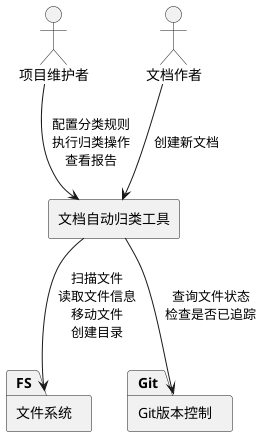
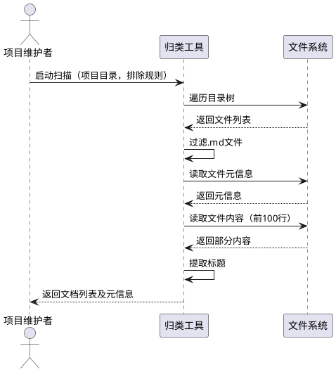
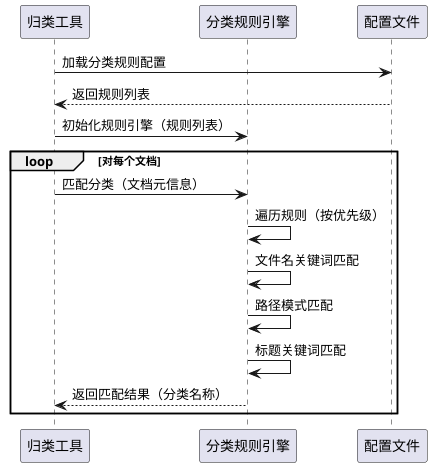
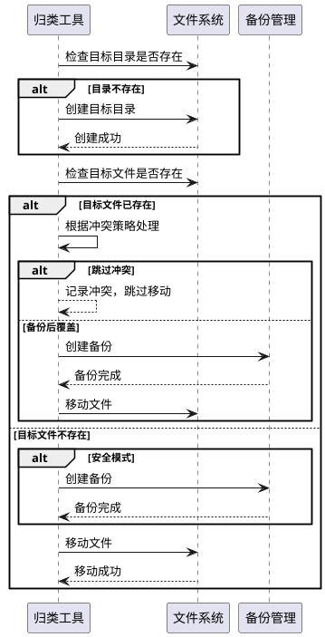
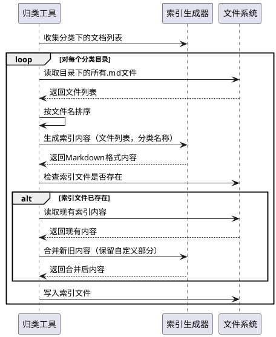
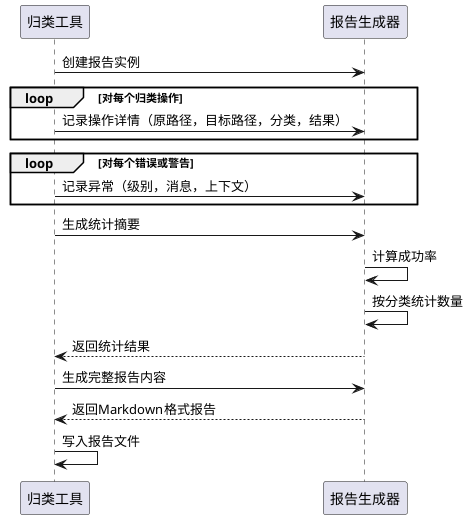

# **1. 组件定位**

## **1.1 核心职责**

本组件负责自动扫描、识别和归类项目中的Markdown文档，实现文档的智能化组织和索引更新。

## **1.2 核心输入**

1. **项目根目录路径**：需要扫描的项目根目录位置
2. **扫描配置参数**：包括扫描范围、排除规则、分类策略等配置信息
3. **待归类文档集合**：项目目录下发现的未归类Markdown文件列表
4. **分类规则定义**：用户自定义的分类规则和关键词映射关系

## **1.3 核心输出**

1. **归类执行报告**：包含已归类文件列表、迁移路径、归类依据等详细信息
2. **更新后的索引文件**：各分类目录下README.md索引文件的内容更新
3. **错误日志记录**：归类过程中遇到的异常、冲突和跳过项记录
4. **统计摘要数据**：归类文档总数、各分类数量、成功率等统计信息

## **1.4 职责边界**

本组件不负责：
- 文档内容的解析和理解（仅基于文件名、路径、标题等元信息）
- Git版本控制操作（不自动提交或推送到远程仓库）
- 文档内容的格式转换和编辑
- 删除或覆盖已存在的文件（除非明确配置允许）
- 处理非Markdown格式的文件

---

# **2. 领域术语**

**Markdown文档**
: 以 `.md` 或 `.markdown` 为扩展名的文本文件，使用Markdown标记语言编写。

**文档分类**
: 根据文档内容主题、功能用途或命名特征，将文档归入预定义类别的过程。

**索引文件**
: 位于分类目录下的README.md文件，包含该分类下所有文档的导航链接和说明。

**分类规则**
: 由关键词、文件名模式、路径模式等条件组成的匹配规则，用于判断文档应归属的分类。

**归类策略**
: 定义如何处理文档分类决策的整体方案，包括规则优先级、冲突处理方式等。

**安全模式**
: 归类操作的一种执行模式，在移动文件前创建备份，允许回滚操作。

---

# **3. 角色与边界**

## **3.1 核心角色**

- **项目维护者**：执行文档归类操作，配置分类规则，查看归类结果报告
- **文档作者**：创建新的Markdown文档，文档将被自动归类工具识别和组织

## **3.2 外部系统**

- **文件系统**：提供文件扫描、读取、移动和目录创建能力
- **Git版本控制系统**：提供文件变更追踪能力（只读取状态，不执行提交）

## **3.3 交互上下文**

---

# **4. DFX约束**

## **4.1 性能**

- 扫描包含1000个文档的项目目录，耗时不得超过10秒
- 单个文档的归类决策（读取元信息+匹配规则）耗时不得超过100毫秒
- 批量移动100个文档的总耗时不得超过5秒

## **4.2 可靠性**

- 在安全模式下，所有文件移动操作必须先创建备份到临时目录
- 如果归类过程中断，已完成的移动操作必须可追溯和可回滚
- 遇到文件名冲突时，必须记录冲突详情并跳过该文件，不得覆盖现有文件

## **4.3 安全性**

- 必须检查目标文件是否已被Git追踪，对于已追踪文件给出明确警告
- 不得处理包含敏感信息的目录（如 `.git`、`node_modules`、`.env` 等）
- 所有文件路径操作必须经过安全验证，防止路径遍历攻击

## **4.4 可维护性**

- 所有归类操作必须生成详细的执行日志，包含时间戳、操作类型、文件路径
- 分类规则配置文件必须支持版本控制和变更追溯
- 归类报告必须包含足够的统计信息，便于验证和审计

## **4.5 兼容性**

- 必须支持Windows、Linux、macOS跨平台运行
- 必须兼容UTF-8编码的文件名和文件内容
- 对于特殊字符命名的文件（如包含空格、中文、特殊符号）必须正确处理

---

# **5. 核心能力**

## **5.1 文档扫描与识别**

### **5.1.1 业务规则**

1. **扫描范围规则**：必须支持配置扫描的根目录和排除目录列表
   - 验收条件：配置了排除目录后，扫描结果中不包含排除目录下的任何文件

2. **文档识别规则**：必须识别所有 `.md` 和 `.markdown` 扩展名的文件
   - 验收条件：扫描目录下存在 `test.md` 和 `readme.markdown` 时，两者均被识别

3. **元信息提取规则**：应当提取文档的文件名、路径、创建时间、修改时间、文件大小等元信息
   - 验收条件：对任意识别的文档，能够获取其完整元信息

4. **标题提取规则**：应当读取文档内容的前100行，提取首个一级标题作为文档标题
   - 验收条件：文档第一行为 `# 快速开始指南` 时，提取到的标题为 "快速开始指南"

5. **禁止项**：不得扫描符号链接指向的外部目录
   - 验收条件：遇到符号链接时，跳过或记录警告，不跟随链接扫描

### **5.1.2 交互流程**

### **5.1.3 异常场景**

1. **目录不存在**
   - 触发条件：指定的扫描根目录不存在
   - 系统行为：记录错误日志，终止扫描操作
   - 用户感知：返回错误提示 "扫描目录不存在: [路径]"

2. **文件读取权限不足**
   - 触发条件：尝试读取文件但权限被拒绝
   - 系统行为：记录警告日志，跳过该文件，继续扫描其他文件
   - 用户感知：在报告中标注 "[跳过] 权限不足: [文件路径]"

3. **文件编码错误**
   - 触发条件：文件内容无法以UTF-8编码解析
   - 系统行为：记录警告日志，尝试其他编码（如GBK），若仍失败则跳过
   - 用户感知：在报告中标注 "[编码异常] [文件路径]，已尝试备用编码"

---

## **5.2 分类规则匹配**

### **5.2.1 业务规则**

1. **文件名关键词匹配规则**：必须支持基于文件名中关键词的匹配
   - 验收条件：配置规则 "快速开始: [快速, 快速, 开始, 入门]" 时，文件名包含任一关键词即匹配成功

2. **路径模式匹配规则**：应当支持基于文件路径的通配符匹配
   - 验收条件：配置规则 "内网发布: **/内网/**, **/internal/**" 时，路径匹配任一模式即归类到内网发布

3. **标题关键词匹配规则**：应当支持基于文档一级标题的匹配
   - 验收条件：文档标题为 "E503错误解决方案" 时，匹配规则 "故障排查: [E503, 错误, 问题, 故障]"

4. **规则优先级规则**：当多个规则匹配时，必须按照配置的优先级顺序选择第一个匹配的分类
   - 验收条件：文件同时匹配"快速开始"和"内网发布"时，按配置顺序选择优先级更高的分类

5. **默认分类规则**：当所有规则均不匹配时，应当归类到预定义的"未分类"目录
   - 验收条件：无规则匹配的文档归类到 "docs/未分类/" 目录

6. **禁止项**：不得使用正则表达式进行匹配（出于安全性和可维护性考虑）
   - 验收条件：配置文件中若包含正则表达式，应拒绝加载并提示错误

### **5.2.2 交互流程**

### **5.2.3 异常场景**

1. **规则配置文件不存在**
   - 触发条件：启动时找不到分类规则配置文件
   - 系统行为：使用内置默认规则，记录警告日志
   - 用户感知：提示 "未找到配置文件，使用默认规则"

2. **规则配置格式错误**
   - 触发条件：配置文件YAML/JSON格式不正确
   - 系统行为：拒绝加载配置，终止操作，记录错误详情
   - 用户感知：返回错误 "配置文件格式错误: [行号], [错误原因]"

3. **所有规则均不匹配**
   - 触发条件：文档不匹配任何已配置规则
   - 系统行为：归类到"未分类"目录
   - 用户感知：在报告中标注 "[未分类] [文件名]"

---

## **5.3 文件移动与目录创建**

### **5.3.1 业务规则**

1. **目录创建规则**：目标分类目录不存在时，必须先创建完整目录路径
   - 验收条件：归类到 "docs/05-问题修复/" 但目录不存在时，自动创建该目录

2. **文件重命名规则**：移动文件时应当保留原文件名，除非配置了重命名规则
   - 验收条件：文件 "README.md" 移动后，目标位置文件名仍为 "README.md"

3. **文件名冲突检测规则**：目标位置已存在同名文件时，必须根据配置策略处理
   - 验收条件：目标文件已存在且配置为"跳过冲突"时，记录冲突并跳过移动

4. **索引文件保护规则**：不得覆盖分类目录下已有的 README.md 索引文件
   - 验收条件：目标目录存在 README.md 时，跳过移动或追加链接而非覆盖

5. **安全备份规则**：在安全模式下，移动文件前必须创建备份到 `_classify_backup_时间戳/` 目录
   - 验收条件：执行移动后，备份目录中存在原文件的完整副本

6. **禁止项**：不得移动文件到项目根目录之外的位置
   - 验收条件：目标路径解析后超出项目根目录时，拒绝移动并记录错误

### **5.3.2 交互流程**

### **5.3.3 异常场景**

1. **目标目录创建失败**
   - 触发条件：文件系统权限不足，无法创建目录
   - 系统行为：记录错误，跳过该分类的所有文件移动
   - 用户感知：返回错误 "无法创建目录: [路径]，权限不足"

2. **文件移动失败**
   - 触发条件：磁盘空间不足或文件被占用
   - 系统行为：记录错误，跳过该文件，继续处理其他文件
   - 用户感知：在报告中标注 "[移动失败] [文件路径]，原因: [错误信息]"

3. **备份创建失败**
   - 触发条件：安全模式下备份目录创建或文件复制失败
   - 系统行为：终止操作，记录错误，不执行任何移动
   - 用户感知：返回错误 "备份失败，归类操作已终止"

---

## **5.4 索引文件更新**

### **5.4.1 业务规则**

1. **索引文件定位规则**：必须在每个分类目录下创建或更新 README.md 索引文件
   - 验收条件：归类完成后，各分类目录下均存在 README.md 文件

2. **索引内容格式规则**：索引文件必须包含分类名称、文档列表、创建时间等信息
   - 验收条件：索引文件格式为 Markdown，包含标题、表格形式的文档列表

3. **链接生成规则**：索引文件中的文档链接必须使用相对路径，确保跨平台兼容
   - 验收条件：链接格式为 `[文档标题](./文档名称.md)`

4. **增量更新规则**：更新已存在的索引文件时，应当保留手动添加的自定义内容
   - 验收条件：索引文件中用户手动添加的说明文字在更新后仍然保留

5. **排序规则**：索引文件中的文档列表应当按照文件名自然排序
   - 验收条件：文档列表顺序与文件名字典序一致

6. **禁止项**：索引文件中不得包含指向项目外部的链接
   - 验收条件：所有链接的目标文件必须存在于项目目录内

### **5.4.2 交互流程**

### **5.4.3 异常场景**

1. **索引文件写入失败**
   - 触发条件：文件系统权限不足或磁盘空间不足
   - 系统行为：记录错误，继续处理其他目录
   - 用户感知：在报告中标注 "[索引更新失败] [目录路径]"

2. **索引文件格式损坏**
   - 触发条件：现有索引文件内容不符合预期格式，无法解析
   - 系统行为：创建备份，重新生成索引文件
   - 用户感知：提示 "索引文件格式异常，已重新生成: [路径]"

---

## **5.5 归类报告生成**

### **5.5.1 业务规则**

1. **报告内容完整性规则**：归类报告必须包含统计摘要、详细记录、错误列表三部分
   - 验收条件：报告文件包含"统计信息"、"归类详情"、"错误和警告"三个章节

2. **统计信息规则**：必须包含总文档数、成功归类数、跳过数、失败数、各分类数量
   - 验收条件：统计信息准确反映归类操作的实际结果

3. **详细记录规则**：每个归类操作必须记录原路径、目标路径、分类依据、执行时间
   - 验收条件：可通过详细记录追溯每个文件的处理过程

4. **错误分级规则**：错误和警告必须分级标注（ERROR、WARN、INFO）
   - 验收条件：ERROR 级别影响归类成功率，WARN 级别仅记录异常但不影响

5. **报告格式规则**：报告必须使用 Markdown 格式，便于阅读和版本控制
   - 验收条件：报告文件扩展名为 `.md`，内容符合 Markdown 语法

### **5.5.2 交互流程**

### **5.5.3 异常场景**

1. **报告文件写入失败**
   - 触发条件：无法写入报告文件到指定位置
   - 系统行为：将报告内容输出到控制台，记录警告
   - 用户感知：提示 "报告文件写入失败，已输出到控制台"

---

# **6. 数据约束**

## **6.1 文档元信息**

- **文件路径**：必须为绝对路径，相对于项目根目录的完整路径
- **文件名**：必须包含扩展名，且扩展名为 `.md` 或 `.markdown`
- **文档标题**：如果提取失败，默认使用文件名（不含扩展名）
- **文件大小**：必须为非负整数，单位为字节
- **创建时间**：必须为有效的ISO 8601格式时间字符串
- **修改时间**：必须为有效的ISO 8601格式时间字符串

## **6.2 分类规则配置**

- **规则名称**：必须为非空字符串，作为分类目录名称
- **关键词列表**：必须为字符串数组，至少包含一个关键词
- **路径模式**：可选，必须为有效的glob模式字符串
- **优先级**：必须为正整数，数值越小优先级越高
- **目标目录**：必须为相对于项目根目录的相对路径

## **6.3 归类执行记录**

- **操作类型**：必须为枚举值之一（MOVE、SKIP、ERROR）
- **原文件路径**：必须为绝对路径
- **目标文件路径**：操作类型为MOVE时必须为有效路径，其他类型可为空
- **分类名称**：必须为非空字符串
- **匹配规则**：记录实际匹配的规则名称，未匹配时为空
- **执行结果**：必须为枚举值之一（SUCCESS、SKIP、FAILED）
- **错误信息**：执行结果非SUCCESS时必须包含错误描述

## **6.4 归类统计信息**

- **扫描文档总数**：必须为非负整数
- **成功归类数量**：必须为非负整数，且不大于扫描总数
- **跳过数量**：必须为非负整数
- **失败数量**：必须为非负整数
- **各分类数量**：必须为键值对，键为分类名称，值为该分类下的文档数量
- **执行耗时**：必须为非负数，单位为秒，精确到毫秒
