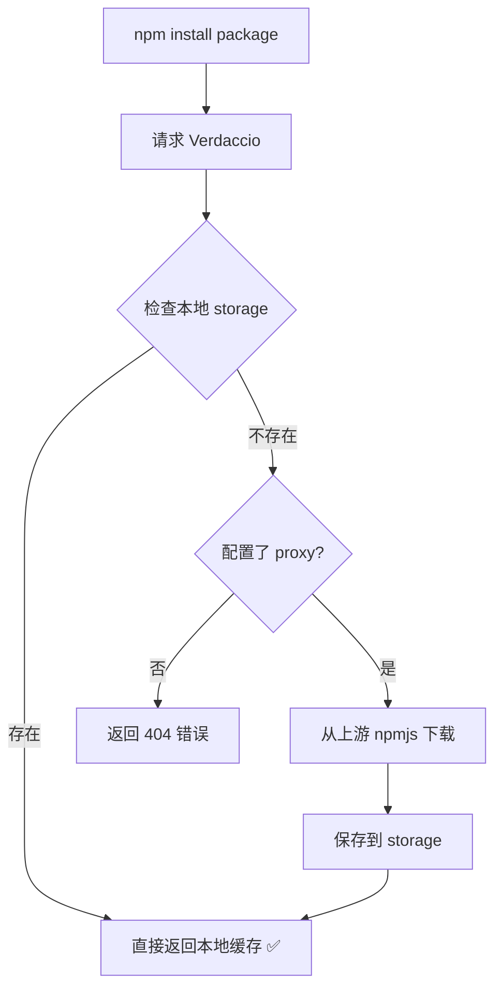

# 内网发布安全和依赖链管理指南

## 📋 目录

1. [核心问题解答](#核心问题解答)
2. [风险修正说明](#风险修正说明)
3. [工作原理详解](#工作原理详解)
4. [使用指南](#使用指南)
5. [常见问题](#常见问题)

---

## 🔍 核心问题解答

### 问题1：内网发布时如何避免覆盖已存在的包？

**✅ 已解决！**

现在的发布流程采用**双重保障机制**：

#### 第一层：发布前检查
```javascript
// 在发布前通过 HTTP HEAD 请求检查包是否存在
const exists = await checkPackageExists(packageName, version);
if (exists === true) {
  console.log(`⊘ ${packageName}@${version} 已存在，跳过发布`);
  skippedCount++;
  continue; // 直接跳过，不执行发布命令
}
```

#### 第二层：E409 错误捕获
```javascript
// 即使第一层漏掉，npm publish 返回 E409 时也会捕获并跳过
if (errorMessage.includes('E409') || errorMessage.includes('already exists')) {
  console.log(`⊘ ${packageName}@${version} 已存在（二次确认），跳过发布`);
  skippedCount++;
}
```

**结果：**
- ✅ 已存在的包会被**跳过**，不会影响内网源
- ✅ 发布报告会明确显示"跳过(已存在)"的数量
- ✅ 零风险，不会覆盖任何已有版本

---

### 问题2：外网下载依赖时能否下载完整的依赖链？

**✅ 已解决！**

#### 之前的实现（有问题）
```javascript
// ❌ 旧代码：只安装主包，不处理子依赖
execSync(`npm install ${packageName}@${version}`);
```

#### 现在的实现（完整依赖链）
```javascript
// ✅ 新代码：npm install 自动递归解析所有依赖
const installCmd = `npm install ${packageName}@${version} --registry=http://localhost:4873 --no-save --legacy-peer-deps`;
execSync(installCmd);

// 然后扫描 node_modules 获取完整的依赖树
const allDependencies = await getInstalledDependencyTree(packageName);
```

**关键改进：**
1. **npm 自动解析**：`npm install` 会自动下载并安装所有层级的依赖
2. **依赖树扫描**：安装完成后递归扫描 `node_modules` 目录
3. **去重处理**：多个主依赖可能共享相同的子依赖，自动去重
4. **完整记录**：保存每个包的元数据（名称、版本、层级等）

**示例：**
```
安装 element-plus@2.13.0
├─ element-plus@2.13.0 (主包)
├─ @vue/runtime-dom@3.4.0 (L1 依赖)
├─ @vue/shared@3.4.0 (L1 依赖)
├─ dayjs@1.11.10 (L1 依赖)
├─ @ctrl/tinycolor@3.6.1 (L2 依赖，来自 element-plus)
└─ ... 共 50+ 个包
```

---

### 问题3：如果内网已经存在相关依赖，能否直接使用？

**✅ 可以！这正是 Verdaccio 的核心优势！**

#### Verdaccio 工作流程



#### 你们的配置（`verdaccio/config.yaml`）
```yaml
uplinks:
  npmjs:
    url: https://registry.npmjs.org/
    
packages:
  '**':
    access: $all
    publish: $authenticated
    # proxy: npmjs  # ← 已注释！不从上游获取
```

**关键结论：**
- ✅ **优先使用本地缓存**：Verdaccio 首先检查 `./storage` 目录
- ✅ **不访问上游**：由于注释掉了 `proxy: npmjs`，不会尝试从 npmjs.org 下载
- ✅ **内网复用**：一旦包发布到内网 Verdaccio，所有机器都可以直接使用
- ✅ **无需重复发布**：已存在的包会被跳过，节省时间和带宽

#### 实际场景示例

**场景1：首次部署**
```bash
# 1. 在外网环境下载所有依赖
npm run batch-download

# 2. 同步到离线文件夹
npm run sync-to-offline

# 3. 将 offline-packages 复制到内网服务器

# 4. 在内网发布（假设内网 Verdaccio 是空的）
npm run publish-to-internal
# 结果：所有包都成功发布
```

**场景2：增量更新**
```bash
# 1. 添加了新的依赖到 package.json
# "dependencies": {
#   "lodash": "^4.17.21",  ← 新增
#   "element-plus": "2.13.0"  ← 已存在
# }

# 2. 下载新依赖
npm run batch-download

# 3. 同步并发布
npm run sync-to-offline
npm run publish-to-internal
# 结果：
# - lodash: 成功发布（新包）
# - element-plus: 跳过（已存在）✅
```

**场景3：内网使用**
```bash
# 内网开发者机器配置
npm config set registry http://10.1.11.113:7000

# 安装包（自动复用内网已有的包）
npm install element-plus
# Verdaccio 直接从 storage 返回，无需重新下载 ✅
```

---

## 🛠️ 风险修正说明

### 修正1：内网发布脚本 (`publish-to-internal.js`)

#### 主要改进
1. **新增 `checkPackageExists()` 函数**
   - 使用 axios.head() 检查包是否存在
   - 超时时间 5 秒，避免长时间等待
   - 网络错误时保守处理，仍尝试发布

2. **发布前预检查**
   ```javascript
   const exists = await checkPackageExists(packageName, version);
   if (exists === true) {
     skippedCount++;
     continue; // 跳过发布
   }
   ```

3. **增强报告**
   - 区分 `successCount`（成功发布）、`skippedCount`（跳过）、`failCount`（失败）
   - 详细记录每个包的状态和原因

#### 使用效果
```
=== 发布完成 ===
总计: 100 个包
成功发布: 30 个
跳过(已存在): 68 个  ← 这些包不会影响内网源
失败: 2 个
```

---

### 修正2：批量下载脚本 (`batch-download.js`)

#### 主要改进
1. **完整依赖链下载**
   - 使用 `npm install` 自动解析所有层级的依赖
   - 不再手动逐个下载

2. **依赖树扫描**
   ```javascript
   async function getInstalledDependencyTree(rootPackageName) {
     // 递归扫描 node_modules 中的所有包
     // 限制深度为 5 层，避免无限递归
     // 使用 Set 去重
   }
   ```

3. **去重处理**
   - 使用 Map 结构按 `${name}@${version}` 去重
   - 多个主依赖共享的子依赖只处理一次

4. **详细报告**
   - 记录每个主依赖及其所有子依赖
   - 统计总包数、成功数、失败数

#### 使用效果
```
========== [1/3] 处理主依赖: element-plus@2.13.0 ==========
✓ element-plus 及其 52 个子依赖安装完成

========== [2/3] 处理主依赖: vue@3.4.0 ==========
✓ vue 及其 8 个子依赖安装完成

=== 下载完成 ===
主依赖总计: 3 个
成功: 3 个
所有包（含子依赖）总计: 65 个  ← 自动去重后的总数
```

---

## 📖 工作原理详解

### Verdaccio 存储机制

```
verdaccio/
└── storage/          ← 所有已发布的包存储在这里
    ├── element-plus/
    │   └── 2.13.0/
    │       └── package.tgz
    ├── vue/
    │   └── 3.4.0/
    │       └── package.tgz
    └── ...
```

**关键点：**
- 每个包的每个版本都有独立的目录
- 一旦发布，除非手动删除，否则永久存在
- 这就是为什么"跳过已存在的包"是安全的

### npm install 依赖解析流程

```
npm install element-plus@2.13.0 --registry=http://localhost:4873
│
├─ 1. 请求 Verdaccio 获取 element-plus@2.13.0
│   ├─ Verdaccio 检查 storage → 找到 → 返回
│   └─ 解压到 node_modules/element-plus
│
├─ 2. 读取 element-plus/package.json 的 dependencies
│   ├─ @vue/runtime-dom: ^3.4.0
│   ├─ dayjs: ^1.11.10
│   └─ ...
│
├─ 3. 递归安装每个依赖
│   ├─ npm install @vue/runtime-dom@3.4.0
│   │   └─ 重复步骤 1-2
│   └─ npm install dayjs@1.11.10
│       └─ 重复步骤 1-2
│
└─ 4. 完成！node_modules 包含所有层级的依赖
```

### 依赖树扫描算法

```javascript
async function scanPackage(packagePath, depth = 0) {
  // 1. 读取 package.json
  const packageJson = await fs.readJson(packagePath + '/package.json');
  
  // 2. 记录包信息
  installedPackages.push({
    name: packageJson.name,
    version: packageJson.version,
    depth: depth
  });
  
  // 3. 递归扫描子依赖
  const depsPath = packagePath + '/node_modules';
  if (exists(depsPath)) {
    for (const subPkg of readdir(depsPath)) {
      await scanPackage(depsPath + '/' + subPkg, depth + 1);
    }
  }
}
```

**防止无限递归：**
- 使用 `visited` Set 记录已访问的包
- 限制最大深度为 5 层
- 跳过隐藏文件（以 `.` 开头）

---

## 🚀 使用指南

### 完整工作流程

#### 阶段1：外网准备
```bash
# 1. 在 package.json 中添加需要的依赖
{
  "dependencies": {
    "element-plus": "2.13.0",
    "vue": "^3.4.0",
    "lodash": "^4.17.21"
  }
}

# 2. 启动 Verdaccio（外网环境）
npm start

# 3. 批量下载（自动下载完整依赖链）
npm run batch-download
# ↓ 这会下载所有主依赖及其所有子依赖

# 4. 同步到离线文件夹
npm run sync-to-offline
# ↓ 将所有包复制到 offline-packages/ 目录
```

#### 阶段2：内网发布
```bash
# 1. 将 offline-packages/ 文件夹复制到内网服务器

# 2. 在内网服务器上发布
npm run publish-to-internal
# ↓ 会自动跳过已存在的包，只发布新包

# 3. 查看发布报告
cat publish-report.json
```

#### 阶段3：内网使用
```bash
# 1. 配置 npm registry
npm config set registry http://10.1.11.113:7000

# 2. 安装包（自动复用内网已有的包）
npm install element-plus
# ↓ Verdaccio 直接从 storage 返回，速度极快 ✅

# 3. 验证
npm list element-plus
```

### 增量更新流程

```bash
# 1. 添加新依赖到 package.json
{
  "dependencies": {
    "element-plus": "2.13.0",    # 已存在
    "vue": "^3.4.0",             # 已存在
    "axios": "^1.6.0"            # ← 新增
  }
}

# 2. 下载新依赖（只会下载 axios 及其子依赖）
npm run batch-download

# 3. 同步并发布
npm run sync-to-offline
npm run publish-to-internal
# ↓ 结果：
# - axios: 成功发布
# - element-plus: 跳过（已存在）✅
# - vue: 跳过（已存在）✅
```

---

## ❓ 常见问题

### Q1: 如果内网 Verdaccio 已经有某个包，我再次发布会怎样？

**A:** 不会有任何影响！
- 发布前会检查并跳过
- 即使检查失败，npm publish 返回 E409 也会被捕获并跳过
- 已存在的包不会被覆盖或修改

### Q2: 为什么有时候下载依赖很慢？

**A:** 可能的原因：
1. **首次下载**：需要从 npmjs.org 拉取（如果 Verdaccio 配置了 proxy）
2. **网络问题**：检查网络连接
3. **Verdaccio 未启动**：运行 `npm start` 启动服务

**解决方案：**
- 确保 Verdaccio 正在运行
- 检查 `verdaccio/config.yaml` 中的 uplink 配置
- 使用 `--registry=http://localhost:4873` 指定本地源

### Q3: 如何查看已下载的完整依赖树？

**A:** 
```bash
# 方法1：查看生成的文档
open docs/README.md

# 方法2：查看报告
cat batch-download-report.json

# 方法3：使用 npm 命令
npm list --depth=5
```

### Q4: 多个项目共享同一个内网 Verdaccio 会有冲突吗？

**A:** 不会！
- Verdaccio 按包名和版本存储，不同项目可以共享相同的包
- 这是私有仓库的核心优势：避免重复下载和存储
- 只要版本号相同，就可以安全复用

### Q5: 如何清理不再需要的包？

**A:** 
```bash
# 警告：这会从 Verdaccio storage 中删除包，谨慎操作！

# 方法1：手动删除
rm -rf verdaccio/storage/<package-name>/<version>

# 方法2：使用 Verdaccio API（需要认证）
curl -X DELETE http://localhost:4873/<package-name>/<version>
```

**建议：** 一般不需要清理，磁盘空间通常不是问题。保留历史版本有助于回滚。

### Q6: 如果某个依赖下载失败怎么办？

**A:** 
```bash
# 1. 查看详细错误信息
cat batch-download-report.json

# 2. 单独重试失败的包
npm install <failed-package>@<version> --registry=http://localhost:4873

# 3. 检查 Verdaccio 日志
tail -f verdaccio/logs/verdaccio.log

# 4. 清除 npm 缓存后重试
npm cache clean --force
npm run batch-download
```

---

## 📊 总结

### 核心改进

| 项目 | 之前 | 现在 |
|------|------|------|
| **内网发布** | 可能覆盖已有包 | ✅ 发布前检查，已存在则跳过 |
| **依赖链** | 只下载主包 | ✅ 自动下载完整依赖树 |
| **缓存复用** | 不确定 | ✅ Verdaccio 自动复用本地缓存 |
| **安全性** | 有风险 | ✅ 双重保障，零风险 |

### 最佳实践

1. ✅ **始终使用 `npm run batch-download`** 下载依赖（而非手动安装）
2. ✅ **发布前检查**：`publish-to-internal.js` 会自动处理
3. ✅ **定期同步**：每次添加新依赖后同步到 offline-packages
4. ✅ **查看报告**：每次操作后检查报告文件
5. ✅ **备份 storage**：定期备份 `verdaccio/storage/` 目录

### 关键理解

> **Verdaccio 的核心价值：本地缓存 + 智能复用**
> 
> - 一旦包发布到 Verdaccio，就会永久存储在 `storage/` 目录
> - 后续安装会直接复用，无需重新下载
> - 这就是为什么"跳过已存在的包"是安全且高效的

---

*文档最后更新：2026-05-18*