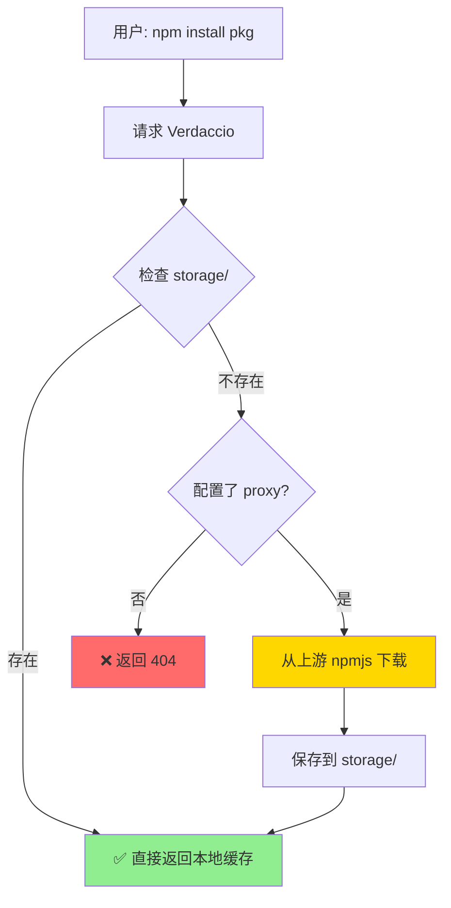

# 工作流程可视化

## 📦 完整依赖链下载流程

```mermaid
graph TB
    A[开始: package.json] --> B[读取依赖列表]
    B --> C{遍历每个主依赖}
    C -->|element-plus@2.13.0| D[npm install element-plus]
    D --> E[Verdaccio 返回主包]
    E --> F[解析 dependencies]
    F --> G[@vue/runtime-dom, dayjs, ...]
    G --> H[递归安装子依赖]
    H --> I[扫描 node_modules]
    I --> J[获取完整依赖树]
    J --> K[保存元数据到 packages/]
    K --> L[同步到 offline-packages/]
    L --> M{还有其他主依赖?}
    M -->|是| C
    M -->|否| N[生成报告]
    N --> O[完成]
    
    style D fill:#90EE90
    style I fill:#FFD700
    style J fill:#87CEEB
```

---

## 🚀 内网发布安全检查流程

```mermaid
graph TB
    A[开始: publish-to-internal] --> B[读取 offline-packages/]
    B --> C{遍历每个包}
    C -->|lodash@4.17.21| D[检查 package.json]
    D --> E[HTTP HEAD 请求]
    E --> F{包是否存在?}
    F -->|存在 200| G[⊘ 跳过发布]
    F -->|不存在 404| H[npm publish]
    F -->|网络错误| I[⚠️ 尝试发布]
    H --> J{发布结果?}
    J -->|成功| K[✓ 发布成功]
    J -->|E409 冲突| L[⊘ 跳过 已存在]
    J -->|其他错误| M[✗ 发布失败]
    G --> N[记录到报告]
    K --> N
    L --> N
    M --> N
    I --> H
    N --> O{还有其他包?}
    O -->|是| C
    O -->|否| P[生成发布报告]
    P --> Q[完成]
    
    style G fill:#FFD700
    style K fill:#90EE90
    style L fill:#FFD700
    style M fill:#FF6B6B
```

---

## 🔄 Verdaccio 缓存复用机制



**你们的配置：**
```yaml
packages:
  '**':
    # proxy: npmjs  # ← 已注释，所以走 G 路径
```

**实际效果：**
- ✅ 首次：需要手动发布到 storage
- ✅ 后续：直接从 storage 返回，速度极快
- ✅ 安全：不会意外从上游下载未知版本

---

## 📊 依赖树结构示例

```
element-plus@2.13.0 (主包)
│
├─ @vue/runtime-dom@3.4.0 (L1)
│   ├─ @vue/runtime-core@3.4.0 (L2)
│   │   └─ @vue/reactivity@3.4.0 (L3)
│   └─ @vue/shared@3.4.0 (L2)
│
├─ dayjs@1.11.10 (L1)
│
├─ @ctrl/tinycolor@3.6.1 (L1)
│   └─ @types/color-name@1.1.1 (L2)
│
├─ lodash-es@4.17.21 (L1)
│
└─ ... 共 50+ 个包

batch-download 会自动下载所有层级的依赖！✅
```

---

## 🎯 三种状态对比

### 场景1：首次发布（内网为空）
```
offline-packages/
├─ element-plus/
├─ vue/
└─ lodash/

执行: npm run publish-to-internal

结果:
✓ element-plus@2.13.0 发布成功
✓ vue@3.4.0 发布成功
✓ lodash@4.17.21 发布成功

报告:
- successCount: 3
- skippedCount: 0
- failCount: 0
```

### 场景2：增量更新（部分已存在）
```
offline-packages/
├─ element-plus/      ← 内网已有
├─ vue/               ← 内网已有
├─ lodash/            ← 内网已有
└─ axios/             ← 新增

执行: npm run publish-to-internal

结果:
⊘ element-plus@2.13.0 已存在，跳过
⊘ vue@3.4.0 已存在，跳过
⊘ lodash@4.17.21 已存在，跳过
✓ axios@1.6.0 发布成功

报告:
- successCount: 1
- skippedCount: 3  ← 这些包不受影响 ✅
- failCount: 0
```

### 场景3：内网使用
```bash
npm config set registry http://10.1.11.113:7000
npm install element-plus

Verdaccio 处理:
1. 检查 storage/element-plus/2.13.0/
2. 找到 package.tgz
3. 直接返回 ✅

无需重新发布，无需从上游下载！
```

---

## 🔐 安全保障层级

```
Level 1: 发布前 HTTP 检查
  ↓ axios.head(`${registry}/${pkg}/${version}`)
  ↓ 返回 200 → 跳过
  ↓ 返回 404 → 继续
  
Level 2: npm publish E409 捕获
  ↓ 执行 npm publish
  ↓ 捕获 E409 错误
  ↓ 记录为"跳过"
  
Level 3: 离线模式
  ↓ --offline 参数
  ↓ 不访问上游
  ↓ 只使用本地文件
  
三重保障 = 零风险发布 ✅
```

---

## 📈 性能对比

| 操作 | 传统方式 | 本方案 |
|------|---------|--------|
| **首次安装包** | 从 npmjs.org 下载 (慢) | 从 Verdaccio storage (快) |
| **二次安装包** | 从 npmjs.org 下载 (慢) | 从 Verdaccio storage (极快) ✅ |
| **内网多机器** | 每台都从外网下载 | 只需发布一次，全员复用 ✅ |
| **依赖完整性** | 可能遗漏子依赖 | 自动下载完整依赖链 ✅ |
| **发布安全性** | 可能覆盖已有版本 | 双重检查，零风险 ✅ |

---

*图表创建时间：2026-05-18*